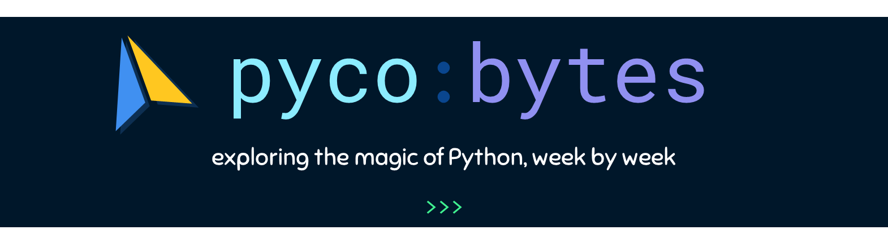

---

Python is awesome. But much of its stacks of fascinating quirks, tricks, and other syntactic sugar good stuff tend to be hidden amidst ancient Stack Overflow posts and questionable reddit threads, which makes discovering it quite nontrivial.

So, ***pycobytes*** is a weekly series where we delve into interesting and useful features in Python. This isn’t a comprehensive overview of the language by any means, but I share all the cool stuff I’ve discovered through years of adventuring.

 

## Issues

| issue | date | title | topic |
| :---- | :--- | :---- | :---- |
| [1](issues/01.md) | – | *The Power of List Comprehensions* | list comprehensions |
