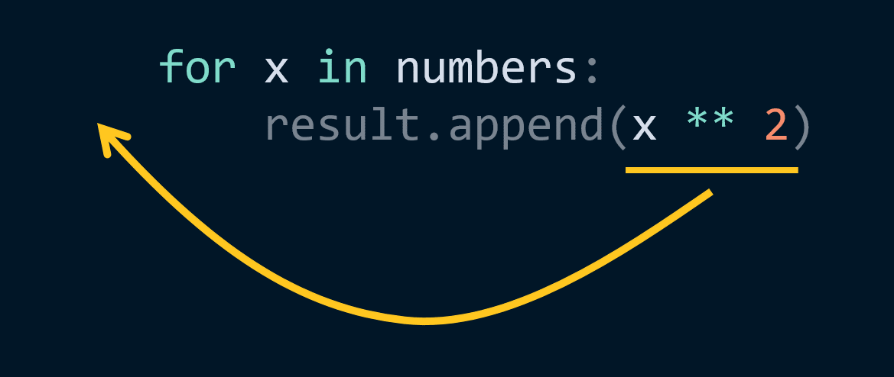

# pycobytes[1] := The Power of List Comprehensions
<!-- #PYCO live!
  | index = 1
  | title = The Power of List Comprehensions
  | date = 6 June 2024
  | topics = tricks / challenge / lists
-->

Hey pips, welcome to the first issue of ***pycobytes***!

We’re gonna dive straight into the deep end and explore one of Python’s most delightful features, what’s known as a *list comprehension*.

There’s a good chance you’ve faced a situation like this before:

* We have a list of objects.
* We want to do something to each of those objects.
* We then need to store those new objects in another list.

For instance, say we have a list `[0, 1, 2, 3, 4]` and want to create a new list with the squares of these numbers.

No problem, we know how to do that!

```py
>>> numbers = [0, 1, 2, 3, 4]
>>> result = []

>>> for x in numbers:
...     result.append(x ** 2)

>>> result
[0, 1, 4, 9, 16]
```

Nice. Now, this works absolutely fine, but what list comprehensions do is let us condense it into this:

```py
>>> result = [x ** 2 for x in numbers]
```

Woah, why did everything shift around? Let’s break it down:



So, a list comprehension is a single *expression* with the `for` loop directly embedded in it. If we test this, we’ll get exactly the same result:

```py
>>> numbers = [0, 1, 2, 3, 4]
>>> result = [x ** 2 for x in numbers]
>>> result
[0, 1, 4, 9, 16]
```

What’s more, we can filter items as we go – just add on an `if` condition at the end:

```py
>>> result = [x ** 2 for x in numbers if x > 0]
>>> result
[1, 4, 9, 16]
```

Now, an object will only be added to the result if it’s less than 10.

---

So that’s cool and all, but why would you want to do this?

Well, for one I think you’d agree there’s a certain elegance about the list comprehension that is hard to surpass. The inversion between the `for` and your iterating variable takes a little getting used to, but once you do, it reads in a really pythonic way – ‘take an x^2, for each x in this iterable, but only if x is positive’. [^zero-positive]

[^zero-positive]: 0 doesn’t have a sign, guys ;)

For those who’ve learnt set theory in maths, you might even notice this reads exactly like set-builder notation, which is where this syntax originated from!

```math
N = {1, 2, 3, 4, 5}
\{ x , x \in{N}, x < 10 \}
```

But most critically, there *is* a difference performance-wise. With this kind of approach:

```py
>>> result = []
>>> for x in numbers:
...     if x < 10:
...         result.append(x ** 2)
```

It might look pretty harmless, but we have to first create an empty list, and then `.append()` to it each iteration. This constantly updates the list, which actually slows the whole thing down a lot. Under the hood, Python stores lists as an array with only a fixed length, so as we add more items, it has to periodically expand the array by allocating more memory – and that takes time.

A list comprehension collects all the items and *then* builds a list with them, which is much more efficient since there’s no resizing at all.

<div class="pyco-deep-dive">

Let’s do some tests! We’ll try each method on a list of 42 numbers, repeating 1 million times, and seeing how long it takes.

```py
>>> numbers = list(range(42))

>>> result = []
... for x in numbers:
...     if x > 0:
...         result.append(x ** 2)
... # 4.785 s

>>> [x for x in numbers if x > 0]
... # 2.250 s - way, way faster!
```

</div>

There’s even more exciting stuff you can do with list comprehensions, but we’ll leave it here for now. Hope you enjoyed!


FURTHER READING
---------------------------------------------------------------------

* [RealPython](https://realpython.com/list-comprehension-python/)
* [Wikipedia](https://en.m.wikipedia.org/wiki/List_comprehension)


CHALLENGE
---------------------------------------------------------------------

Can you write a one-liner to split a number the user inputs into its digits?

```py
>>> Enter a number... 1337
[1, 3, 3, 7]
```

> [!TIP]
> You can use a `for` loop to iterate through the characters of a string, just like you can with a `list` ;)
