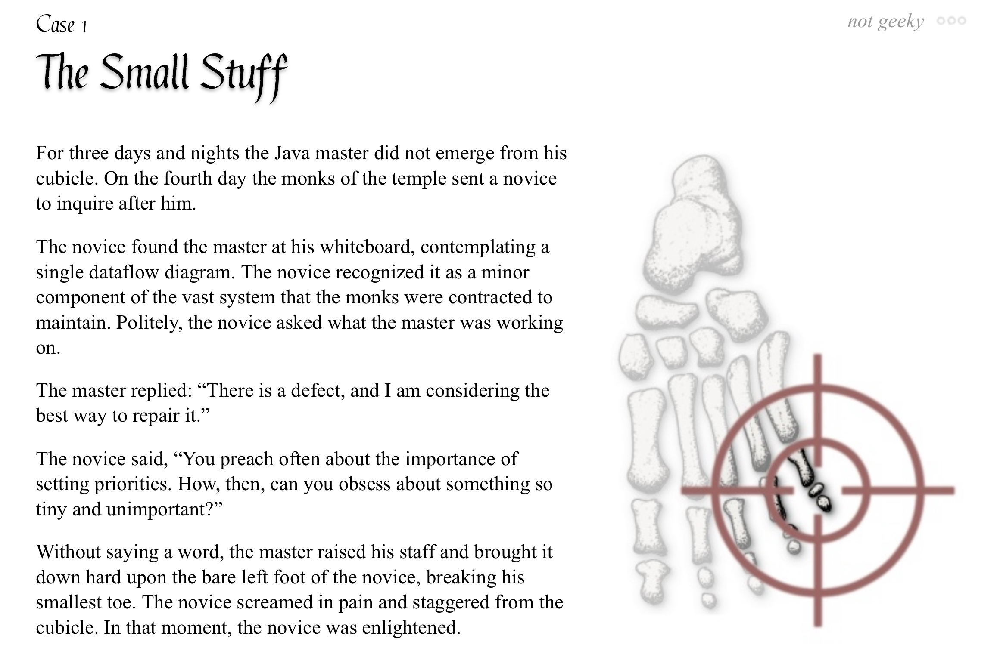

# pycobytes[3] := "A Strand of String Theory"
<!-- #SQUARK live!
| dest = 03
| title = "A Strand of String Theory"
| index = 03
| shard = strings / methods / quickies / challenge
| date = 2024 June 21
-->

> *Why spend 5 minutes doing something manually when you can spend 5 hours automating it?*

Hey pips!

There are 2 really useful **methods** we can use with strings – `.split()` and `.join()`. These operate exactly as advertised, splitting strings into separate parts, or joining them together into one.

`.split()` couldn’t get any simpler. In fact, you’ll probably figure out exactly how it works just by looking at it:

```py
>>> pypips = "quick brown foxes"

>>> pypips.split()
['quick', 'brown', 'foxes']

>>> pypips.split("o")
['quick br', 'wn f', 'xes']
```

Given a string, it’ll look for a separator, and chop up the string whenever it sees that separator. It then returns a list of the pieces. If we don’t pass in any argument, the separator defaults to any form of whitespace (spaces, tabs, newlines).

Also notice that when we passed in `"o"` the ‘o’s had vanished entirely from the pieces in the result. That’s because `.split()` returns the pieces between the separators, and won’t keep the separator itself.

> [!NOTE]
> `.split()` and `.join()` are **methods**, which mean they act on a `str` object that comes before the dot. So you can’t do `split("oh no")` – instead we write `"oh no".split()`. We’ll be covering the difference between functions and methods in a much later issue ;)

Once it comes to `.join()` it becomes a bit peculiar. You might think it would work like this:

```py
>>> words = ["Python", "is", "wacky"]
>>> words.join(" ")
'Python is wacky'
```

That would make sense, right? Pass in the separator as an argument, just like `.split()`.

~~Sykes!~~ I mean sike! It’s the other way round:

```py
>>> " ".join(words)
'Python is wacky'
```

So, for `.join()` we specify the separator as the very `str` object that it’s called on, and pass in an iterable of strings to join with that separator between them. We then get back a single string.

```py
>>> todo = ["study", "code", "sleep"]
>>> "TODO: " + ", ".join(todo)
'TODO: study, code, sleep'
```

Remember, it’s just `.split()` inverted.

Ew, you might think. Why would they make it like that?

I wonder that too, to be honest, and the headcanon I believe to be pretty plausible is that `.join()` is intended to be a `str` method – otherwise, `list`s, `tuple`s and all those other iterables would need to individually implement a `.join()` method.

> Perhaps you would advocate for a general-purpose `join()` function, but remember that we can already add strings, lists and other iterables directly with `+`, which would make it pretty useless.


<br>


## Challenge

Can you write a program to separate the words of an input into separate lines?

```py
>>> "Never Gonna Give You Up"
Never
Gonna
Give
You
Up
```


<br>


## Further Reading

The `str` class – [Python docs](https://docs.python.org/3/library/stdtypes.html#text-sequence-type-str)

Hey look, the internet agrees too! – [reddit](https://www.reddit.com/r/Python/comments/tah71m/why_is_join_the_way_it_is)


<br>


---

<div align="center">

[](http://thecodelesscode.com/case/1)

[*The Codeless Code*, Case 1](http://thecodelesscode.com/case/1)

</div>
