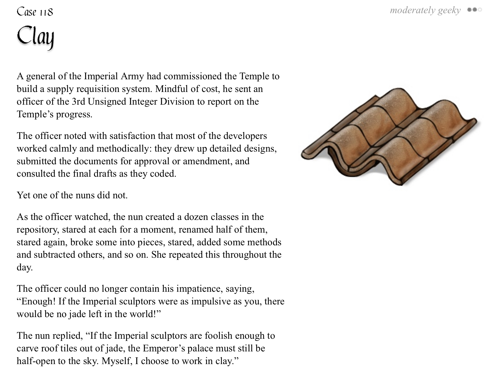

# pycobytes[4] *= "Wait, you can multiply strings?"
<!-- #SQUARK live!
| dest = 04
| title = "Wait, you can multiply strings?"
| index = 04
| shard = strings / operators / tricks / challenge
| date = 2024 June 27
-->

> *Programming is a race between developers striving to build bigger and better idiot-proof programs, and the universe trying to produce bigger and better idiots.*

Hey pips!

We’ve learnt some pretty cool stuff about strings – here’s another quirky thing you can do:

```py
>>> "yo" * 4
'yoyoyoyo'
```

Yup, this works!

Just like we can add strings with `+`, we can also multiply a string by a number to repeat it that many times.

Of course, the number we multiply by has to be an `int`, cuz, well, things would get pretty messy if you tried multiplying a string by a floating-point or complex number.

```py
>>> "uh" * 1.2
TypeError: can't multiply sequence by non-int of type 'float'

>>> "woah" * (1 + 2j)
???
```

The number can come both before or after (in the mathematical lingo, string-int multiplication is commutative), and BIDMAS still applies:

```py
>>> "sup" * 2
'supsup'
>>> 3 * "ha"
'hahaha'
>>> "y" + "o" * 4
'yoooo'
>>> 5 * ("y" + "o")
'yoyoyoyoyo'
```

So, where would we use this?

To be entirely honest, fiddling with strings to this level is quite rare, but when you need it, you’ll be thankful Python has it. Let’s say we just wanted to add an underline to some text:

```py
Underline This
=====
```

The length of that text could change, so we can’t hard-code the `===` characters. But we can dynamically resize it with multiplication!

```py
>>> title = input()
Python is cool

>>> underline = len(title) * "="

>>> print(title + "\n" + underline)
Python is cool
==============
```


<br>


## Deep Dive

Actually, the `*` operator is defined for `list`s too, not just `str`s, which means you can do this:

```py
>>> stuff = [0, 1, 2]
>>> stuff * 2
[0, 1, 2, 0, 1, 2]
```

This can be quite helpful when you need to initialise a list full of the same value:

```py
>>> [0] * 10
[0, 0, 0, 0, 0, 0, 0, 0, 0, 0]
```

> [!Warning]
> There’s just a slight danger with this, in that Python won’t create copies of that object – changing one object in that list might affect the others. This won’t be an issue right now for immutable primitives like `int`s and `str`s, though, so don’t worry (yet). More on that another time!


<br>


## Challenge

Can you write an expression or function that takes in a group of words (no punctuation) as input, and underlines each individual word with `=`?

```py
>>> words = input()
Never Gonna Give You Up
>>> print(your_magic(words))
Never Gonna Give You Up
===== ===== ==== === ==
```

Bonus points for doing it in 2 lines or less ;)


<br>


---

<div align="center">

[](http://thecodelesscode.com/case/118)

[*The Codeless Code*, Case 118](http://thecodelesscode.com/case/118)

</div>
