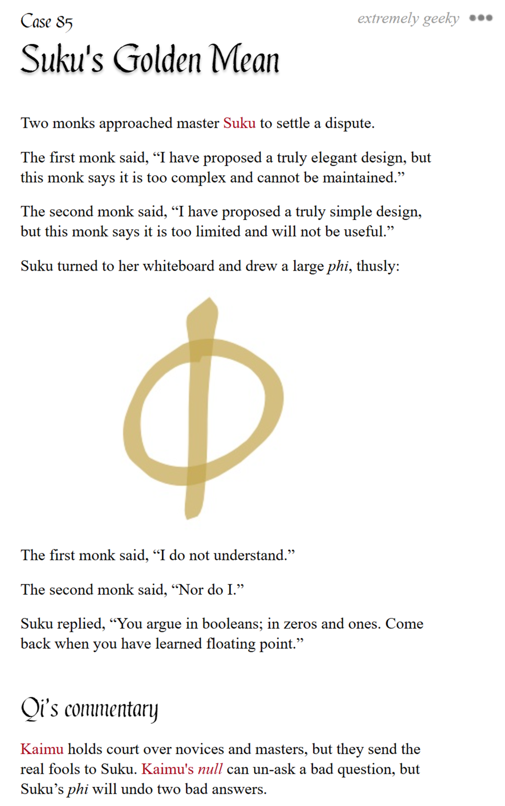

# pycobytes[7] := Alternative Facts
<!-- #SQUARK live!
| dest = 07
| title = Alternative Facts
| head = Alternative Facts
| index = 07
| shard = booleans
| date = 2024 November 5
-->

> *We do things not because they are easy, but because we thought they would be easy.*

Hey pips! What is truth?

Well luckily, programming doesn’t require you to have a PhD in philosophy – in code, it’s pretty clear-cut. `True` is true, `False` is false.

But... programmers will be programmers, and we love making our lives more difficult (only to make them easier later on though, of course). This is why some languages, including Python, allow objects to be ‘truthy’ or ‘falsy’. This feature is called **truthiness**.

Ok but hold on, you’re telling me something can be ‘fals-ish’? Sounds stupid at first, but with time it’ll become quite intuitive.

Let’s look at how an `if` block works. It first checks if the given condition is ‘true’. If it is, then the nested code is executed.

```py
>>> if 1 + 1 == 2:
>>>     print("all good")
all good

>>> if 1 + 1 == 0:
>>>     print("who redefined the reals?")
>>> else:
>>>     print("all good!")
all good!
```

We know the expression `1 + 1 == 2` is evaluating to `True`. So really, our code is saying this:

```py
>>> if True:
>>>     # do stuff
```

Makes sense! *If this statement is true*, do stuff. *If it is raining*, jump in muddy puddles. *If the world is on fire*, laugh about it.

Since all that matters is what the expression after `if` evaluates to, we can store it in a variable:

```py
>>> ready = (1 + 1 == 2)
>>> if ready:
>>>     print("sup")
sup
```

> [!Tip]
> This is pretty nice for readability, btw. If you’ve got many complex conditions, giving them explicit names helps highlight what exactly they represent!

```py
>>> authenticated = SomeAuthenticator.authenticate_stuff().check().status
>>> authorised = SomeDatabase.fetch_perms().includes(access = True)

# see how this reads like plain English!
>>> if authenticated and authorised:
>>>     print("all set.")
>>> elif authenticated and not authorised:
>>>     print("woah, no access!")
>>> else:
>>>     print("who are you?")
```

Alright then, here’s where truthiness comes in. What happens if that variable isn’t `True` or `False`?

```py
>>> if "uh":
>>>     print("woah")
woah
```

Woah. Why did that work?

Evidently, the expression doesn’t need to be exactly `True` for it to work. So what’s going on?

Behind the scenes, the `if` statement is implicitly calling `bool()` on the expression given to it:

```py
>>> bool("uh")
True
```

Interesting. Python thinks `"uh"` is true. True? Truthy!

That, really, is truthiness – it’s what passing an object to the `bool()` constructor would spit out. So `if` doesn’t check if an expression is exactly `True`, it only checks if it’s truthy.

Well the question, then, is what determines an object’s truthiness?

Ha. This is where it’s wildly inconsistent between different programming languages, because they all use their own definition!

Generally, you can think of falsy objects as ‘null’ or ‘empty’. In Python, there are only a select few objects that are falsy. The most common ones you’ll tend to come across are:

- `None` (literally nothing)
- `0` (I mean come on, it’s zero)
- `""` (empty string)
- `[]` (empty list)
- `(,)` (empty tuple)
- `{}` (empty dictionary)
- `set()` (empty set)
- `False` (???)

> [!Tip]
> It also happens that when you call the respective constructors for each of these types (like `int()` or `str()`) without passing in any arguments, these are the ‘default’ values given back.

Anything else, then, is truthy. An iterable with items, a non-zero number, a string with actual characters, etc. Negative numbers (`-0.5`) and strings that contain only whitespace (`" "`) too!

Why does this even exist? It gives us a really clean and idiomatic way to check the nature of an object’s value. For instance:

```py
>>> data = ["never", "gonna", "give", "you", "up"]

# rather than explicitly checking the length...
>>> if len(data) > 0: ...

# ...we can cut the comparison...
>>> if len(data): ...
# (any number != 0 would be truthy)

# ...or just check the truthiness of the object!
>>> if data: ...
```

Some people might say this is less explicit, which goes against the [Zen of Python<sup>↗</sup>](https://peps.python.org/pep-0020). Nevertheless, it’s become such a staple of Python now, that it’s more pythonic to use it than not!


<br>


## Further Reading

- A detailed introduction to truthiness – [FreeCodeCamp<sup>↗</sup>](https://www.freecodecamp.org/news/truthy-and-falsy-values-in-python)


<br>


## Challenge

Given an iterable of objects, can you output a `list` of those which are truthy?

```py
>>> t = ("terabyte", 0.0, True, "connection", None)

>>> (your_expression)
["terabyte", True, "connection"]
```


<br>


---

<div align="center">

[](http://thecodelesscode.com/case/85)

[*The Codeless Code*, Case 85](http://thecodelesscode.com/case/85)

</div>
