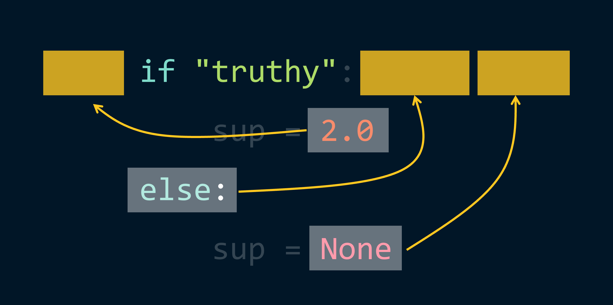
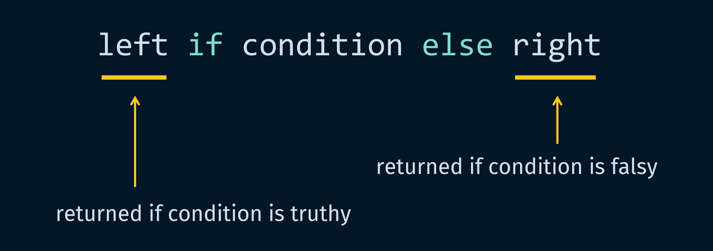
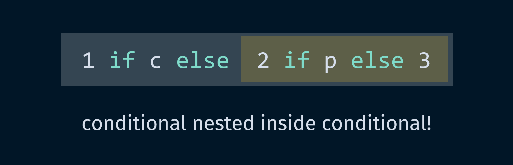

# pycobytes[8] := Collapse if Able, else Expand
<!-- #SQUARK live!
| dest = 08
| title = Collapse if Able, else Expand
| head = Collapse if Able, else Expand
| index = 08
| shard = syntax / tricks / challenge
| date = 2024 November 12
-->

> *There are only 2 hard things in computer science: cache invalidation, and naming things.*

Hey pips!

Remember list comprehensions? They let us condense a `for` loop onto 1 line:

```py
>>> [word.capitalize() for word in ("collatz", "conjecture")]
["Collatz", "Conjecture"]
```

You can do the same with `if` blocks! Normally we’d write this:

```py
>>> if "truthy":
        sup = 2.0
    else:
        sup = None

>>> sup
2.0
```

But we can collapse this into just:

```py
>>> sup = (2.0 if "truthy" else None)
>>> sup
2.0
```

Damn, way more efficient! Let’s break down exactly what happened:



This is called a **ternary conditional operator** – *conditional* since it behaves depending on a condition, and *ternary* because it involves 3 operands. Generalising, it looks like this:



So if the `condition` is *truthy*, `left` is returned from the expression. Otherwise, `right` is returned.

It might seem a bit weird to have the condition in the middle, but it’s another one of Python’s quirks that becomes quite natural once you get used to it!

Now what if we had 2 conditions?

```py
if is_happy():
    message = "pog"
elif is_sad():
    message = "sadge"
else:
    message = "..."
```

The `elif` doesn’t quite carry over. Instead, what we do is recurse the conditional:

```py
message = "pog" if is_happy() else "sadge" if is_sad() else "..."
```

You can think of this like:



We end up with a whole chain of ‘*this* if *that* else *this* if *that* else *just this*’. That can get out of hand pretty quickly. To increase readability, we might consider splitting it over multiple lines:

```py
message = (
    "pog" if is_happy() else
    "sadge" if is_sad() else
    "..."
)
```

But at this point, we haven’t really gained any efficiency or readability... we may as well have just used our original expression.

So this shorthand if expression can be really convenient, but like all things should be used only when suitable. It’s really nice when you have some very simple logic that picks between 2 values:

```py
def absolute_value(x):
    return -x if x < 0 else x
```

Importantly, you should only use it when you want the value that’s *returned* by the expression, like when setting a variable. If you’re just calling different functions:

```py
if is_happy():
    rofl()
elif is_sad():
    weep()
else:
    idle()
```

Then here condensing isn’t great:

```py
rofl() if is_happy() else weep() if is_sad() else idle()
```

Readability aside, it’s non-obvious that we’re just calling functions in-place, rather than trying to get their output.

But if we had the same function being called, but with different inputs, then a conditional would be pretty nice:

```py
send_message(
    ":rofl:" if is_happy() else
    ":weep:" if is_sad() else
    ":idle"
)
```

Enjoy the efficiency, but use judiciously!


<br>


## Further Reading

- Woah, it’s actually called the *ternary conditional operator*! – [Wikipedia<sup>↗</sup>](https://wikipedia.org/wiki/Ternary_conditional_operator)


<br>


## Challenge

Can you write a list comprehension that doubles each number in a list if it is positive, but otherwise makes it zero?

```py
>>> t = [2, -1, 18, 0, -100]

>>> (your_expression)
[4, 0, 36, 0, 0]
```


<br>


---

<div align="center">

[](https://xkcd.com/1296)

[*XKCD*, 1296](https://xkcd.com/1296)

</div>
