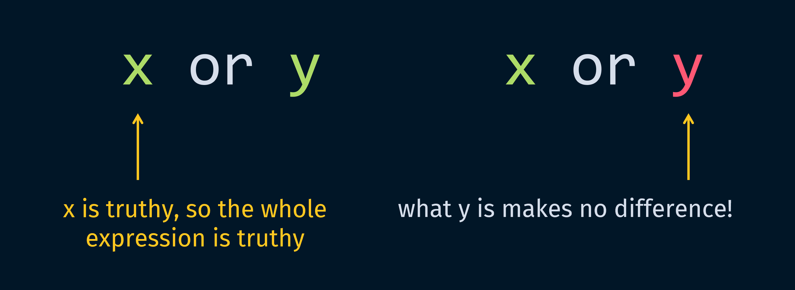
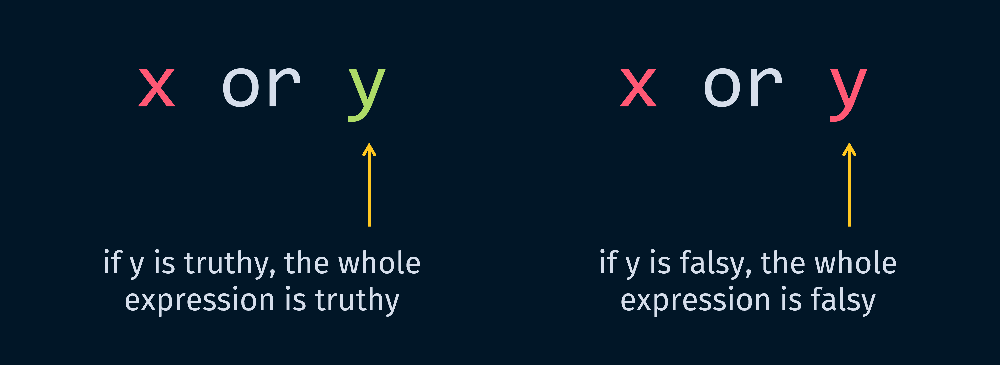
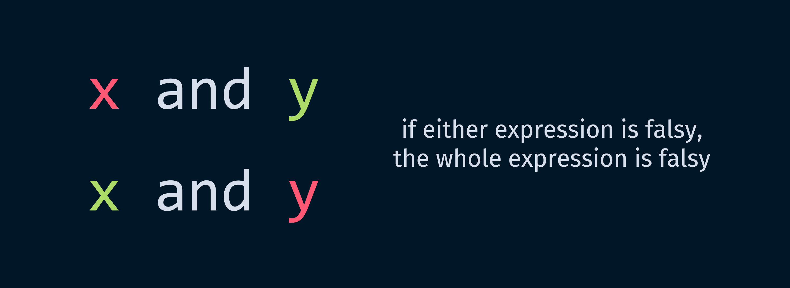
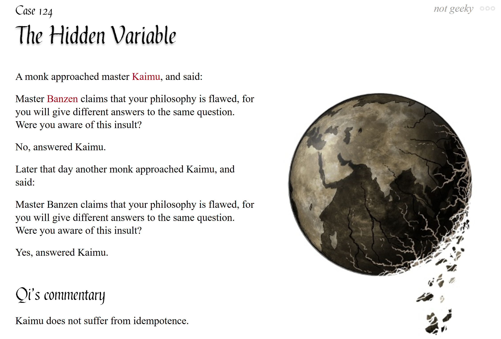

# pycobytes[9] := OR and AND do WHAT now?
<!-- #SQUARK live!
| dest = issues/(issue)/09
| title = OR and AND do WHAT now?
| head = OR and AND do WHAT now?
| index = 09
| shard = booleans / technical / challenge
| date = 2024 November 19
-->

> *Computers will do exactly what you tell them to do, not what you want them to do.*

Hey pips!

We looked at truthiness last week, which was a bit of a wacky concept. Today, I’m going to shatter how you understand `or` and `and`.

It's pretty self explanatory that `if x and y` only executes if `x` *and* `y` are true – or truthy, as we now know – and `if x or y` will execute if either (or both) are truthy.

Let’s try storing one of these expressions in a variable, and see what happens.

```py
>>> win = 0 or 6
>>> if win:
>>>     print("yay")
yay
```

Remember that `6` is considered truthy, which means the `print()` nested inside `if` does run. What’s actually the value of `win` though?

```py
>>> win
6
```

Huh? Not `True`?

Contrary to what you may have been led to believe, `or` and `and` are not like `==` and `<`, which output `True` or `False`. Actually, they return 1 of the 2 expressions they’re given!

So here, we really have:

```py
>>> if 6:
        print("yay")
yay
```

But how do we know which expression is returned?

Let’s think about how an OR statement works. In `x or y`, if we know 1 of `x` or `y` is truthy, then we immediately know the whole expression must be truthy.

Python will look at `x` first. If it’s truthy, then it doesn’t matter what `y` is – no matter what, the whole expression is truthy.



So Python returns `x` from the expression:

```py
>>> 3 or 4
3

>>> "life" or None
'life'

>>> [0, 1, 2] or [3, 4, 5]
[0, 1, 2]
```

But if `x` is falsy, then we *do* need to look at the truthiness of `y`. In fact, the truthiness of the whole expression is now determined by `y` – if it’s falsy, the expression is falsy; if it’s truthy, the expression is truthy.



So in this case, Python returns `y` from the expression:

```py
>>> None or 2.0
2.0

>>> False or ""
''

>>> [] or [9, 9, 6]
[9, 9, 6]
```

And guess what, this is actually just a ternary conditional!

```py
# this conditional...
x if x else y

# is identical to:
x or y
```

Now let’s look at `and`. Can guess how it works?

`x and y` is only truthy if both `x` and `y` are truthy. So (contrapositively 🔥) if either `x` or `y` is falsy, then the whole expression must be false.



Once again, we’ll look at the expressions from left to right. If Python comes across `x` and sees that it’s falsy, then it knows the whole expression is falsy. So it returns `x`:

```py
>>> 0 and 5
0

>>> None and "link"
None

>>> {} and {"state": "pondering"}
{}
```

But if `x` is truthy, then like before, the truthiness of the whole expression now rests on the metaphorical shoulders of `y` – if it’s truthy, the expression is truthy, if it’s falsy, the expression is falsy.

So in this case, Python returns `y`:

```py
>>> "project" and "sekai"
'sekai'

>>> True and 3
3

>>> [-1, 1] and []
[]
```

It takes a little more time to get *comfortable* with using `or` and `and` in this way, but you’ll find some neat situations where they come in quite handy!


<br>


## Further Reading

- Boolean algebra &ndash; [Wikipedia<sup>↗</sup>](https://wikipedia.org/wiki/Boolean_algebra)


<br>


## Challenge

You’re given 2 objects, `py` and `co`. 1 of them is truthy, 1 is falsy. Can you write an expression to print the truthy one first, followed by the falsy one?

```py
>>> py = "aleph"
>>> co = 0

>>> (your_expression)
aleph
0
```


<br>


---

<div align="center">

[](http://thecodelesscode.com/case/124)

[*The Codeless Code*, Case 124](http://thecodelesscode.com/case/124)

</div>
