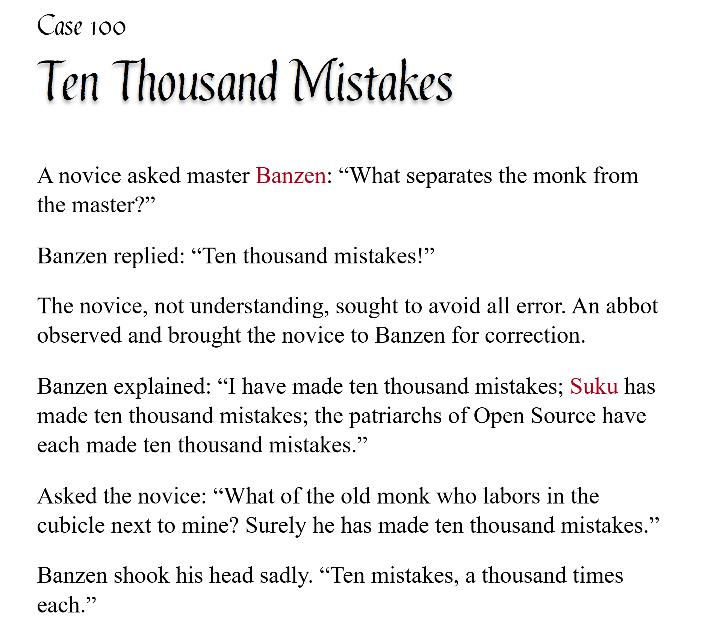

# pycobytes[11] := Short Circuits
<!-- #SQUARK live!
| dest = issues/(issues)/11
| title = Short Circuits
| head = Short Circuits
| index = 11
| shard = technical / challenge
| date = 2024 December 2
-->

> *Experience is the name everyone gives to their mistakes.*

Hey pips!

In the past 3 issues we’ve looked at the ternary conditional operator `x if c else y`, the `or` and `and` logical operators, and the `any()` and `all()` functions.

All of these leverage a particular feature known as **short-circuiting**.

Unlike a short-circuit in electronics, this won’t break your code – in fact, it exists to increase its efficiency. However, if you’re not aware of how it works, you might find yourself unknowingly tripped up by it!

Short circuiting is perhaps most easily understood with the `any()` function. Remember that this checks if *any* (1 or more) of the objects in an iterable are truthy.

```py
>>> stuff = [0, None, "hi", False, -2]
>>> any(stuff)
True
```

Let’s think about what `any()` might be doing behind the scenes. We’d expect it to iterate over the objects of the iterable, checking if each one is truthy.

```py
def recreating_any(iterable):
    out = False

    for item in iterable:
        if item:
            out = True
            # we’ve found a truthy object!

    return out
```

By the end, if we’ve found a truthy object, `out` will be set to `True` and so the function will return `True`. Looks good!

But here’s the thing – after `out` is set to `True`, it stays `True`, and won’t change again. In other words, once 1 truthy object is found, we know the output should be `True`. We don’t care about the rest of the objects, since they’ll make no difference to the output.

This means we can actually return `True` immediately:

```py
def quicker_any(iterable):
    for item in iterable:
        if item:
            return True
            # iterable has a truthy object!

    return False
```

That, right there, is what we call “short-circuiting”. It’s the function returning early without fully evaluating. Why spend time computing stuff you don’t need, right? It’s a tiny, tiny micro-optimisation, but it can add up when the objects involved get large. 💯

If you think about it, `any()` can really be seen as a chain of `or`s – all of which short-circuit!

```py
any([p, q, r, s]) == ((p or q) or r) or s
```

So let’s consider `x or y`. We know that if `x` is truthy, then `x` is returned from the expression since `y` makes no difference. But because of short-circuiting, Python won’t even compute `y` at all! We can demonstrate this with some tracing:

```py
>>> def x():
        print("computing x...")
        return 1

>>> def y():
        print("computing y...")
        return 2

>>> if x() or y():
        print("done!")
computing x...
done!
```

Notice `computing y...` never got printed, because `y` was never called. If we now make `x()` return something falsy:

```py
>>> def x():
        print("computing x...")
        return 0

>>> if x() or y():
        print("done!")
computing x...
computing y...
done!
```

We can see `y` *was* called this time!

This short-circuiting behaviour applies identically to the others:

- `all(items)`: All objects in `items` must be truthy. So if one is falsy, the ‘streak’ is broken and the function short-circuits, returning `False` without checking the rest of the objects.
- `x and y`: If `x` is falsy, then `y` is never computed.
- `x if c else y`: If `c` is truthy, then `x` is returned and `y` is never computed.

See if you notice short-circuiting anywhere elsewhere in Python!


<br>


## Further Reading

- Unexpected dangers of short-circuiting – [timing attacks](https://codahale.com/a-lesson-in-timing-attacks)


<br>


---

<div align="center">

[](http://thecodelesscode.com/case/100)

[*The Codeless Code*, Case 100](http://thecodelesscode.com/case/100)

</div>
