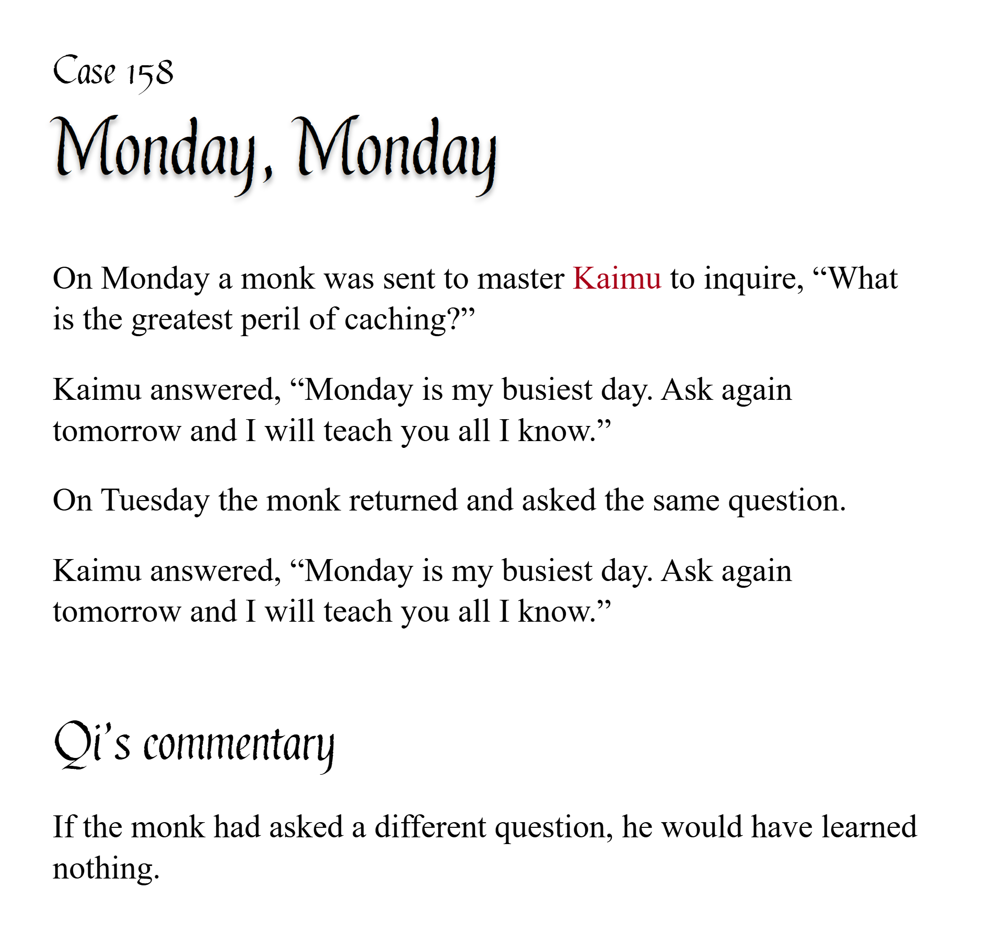

# pycobytes[13] := Counting
<!-- #SQUARK live!
| dest = issues/(issue)/13
| title = Counting
| head = Counting
| index = 13
| tags = functions / challenge
| date = 2024 December 12
-->

> *If at first you do not succeed, call it version 1.0.*

Hey pips!

When using a `for` loop, it’s often really useful to know which iteration number we’re on.

```py
>>> for i in range(3):
        print(f"iteration {i}")
iteration 0
iteration 1
iteration 2
```

But if we’re iterating over an iterable, we don’t have a variable to count the iteration...

```py
>>> l = ["clear", "wing"]

>>> for item in l:
        print(f"unknown iteration: {item}")
unknown iteration: clear
unknown iteration: wing
```

A pretty quick fix is to just make your own counting variable, and manually increment it each iteration.

```py
>>> i = 0
>>> l = ["starving", "venom"]

>>> for item in l:
        print(f"iteration {i}: {item}")
        i += 1  # manually increment
iteration 0: starving
iteration 1: venom
```

> [!Tip]
> This approach is useful when you need to do other stuff with the increment variable – although to be honest, if you’ve reached that stage it may be indicative of other issues.

But with how often this comes up, you would think there’s an in-built solution.

Well this is Python, so of course there is!

```py
>>> l = ["phantom", "knight"]

>>> for i, item in enumerate(l):
        print(f"iteration {i}: {item}")
iteration 0: phantom
iteration 1: knight
```

The built-in `enumerate()` function works on any iterable. It pairs each item with its index to form an `(index, item)` tuple, so that when you iterate over it you can extract both the iteration index and item value.

```py
>>> l = ["blue", "eyes", "white", "dragon"]

>>> list(enumerate(l))
[(0, "blue"),
 (1, "eyes"),
 (2, "white"),
 (3, "dragon")]
```

You can use `enumerate()` on any iterable, including `str`, `tuple` and even `dict` objects.

```py
>>> list(enumerate("sup"))
[(0, "s"),
 (1, "u"),
 (2, "p")]
```

Using this, we now have an extremely convenient way to count iterations while we’re looping – particularly in list comprehensions:

```py
>>> text = "Never Gonna Give You Up"
>>> out = [
        # capitalise every other character
        char.upper() if i % 2 == 0 else char.lower()
        for i, char in enumerate(text)
    ]
>>> "".join(out)
NeVeR GoNnA GiVe yOu uP
```

And fun fact, you can even pass in a second numerical argument to specify the starting index!

```py
>>> l = ["iTechnicals", "Sup"]
>>> [f"{i}: {player}" for i, player in enumerate(l, 1)]
["1: iTechnicals", "2: Sup"]
```

Keep in mind `enumerate()` doesn’t exactly return a `list`, so you can’t index it:

```py
>>> e = enumerate("phantasm")
>>> e[1]
Error:
```

If you want the raw items, just convert the output to a `list` with the `list()` constructor.

```py
>>> l = list(enumerate("desync"))
>>> l[2]
(2, "s")
```

This is because `enumerate()` actually returns an **iterator** which acts as a proxy to the original object. We’ll take a closer look at these a future issue!


<br>


## Challenge

Given a list of fruit and how many to purchase as tuples, can you print a shopping list?

```py
>>> shopping = [
        ("apricots", 3),
        ("bloomerangs", 4),
        ("carrots", 2),
        ("dragonfruit", 1)
    ]

>>> (your_expression)
1. apricots x3
2. bloomerangs x4
3. carrots x2
4. dragonfruit
```

And bonus points for making it as fancy as you can :P

```
=====================
| 1 | durian  |  x7 |
| 2 | acai    |  x3 |
| 3 | lychee  | x10 |
| 4 | pomelo  |  x2 |
---------------------
|     TOTAL   | x22 |
=====================
```


<br>


---

<div align="center">

[](http://thecodelesscode.com/case/158)

[*The Codeless Code*, Case 158](http://thecodelesscode.com/case/158)

</div>
