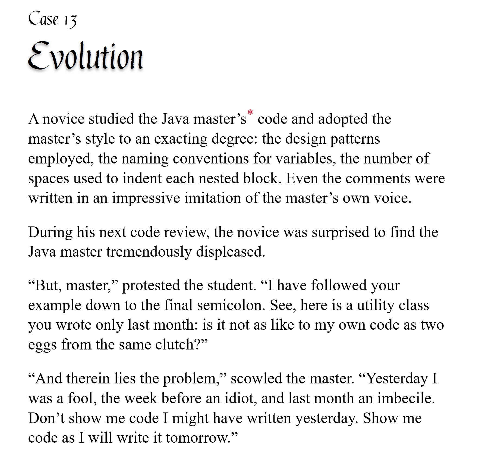

# pycobytes[14] := SyntaxError on line 42
<!-- #SQUARK live!
| dest = issues/(issue)/14
| title = SyntaxError on line 42
| head = SyntaxError on line 42
| index = 14
| tags = syntax / quirks
| date = 2024 December 17
-->

> *If debugging is the process of removing bugs, then programming must be the process of putting them in.*

Hey pips!

Python is known for its clean and simple syntax. Unlike most C-based languages, you don’t need to enclose blocks with curly braces, or end your lines with a semicolon...

```cs
public static void Main(string[] args)
{
    return "Hello world!";
}
```

But did you know you *can* actually use semicolons in Python?

```py
very = "cursed";
```

And in fact, it lets you write multiple statements on 1 line:

```py
even = "more"; cursed = True
```

PSA: Do not write Python like this!

The reason other languages use semicolons is to explicitly indicate the end of statements. For instance, when you have a statement running over multiple lines:

```cs
int Test()
{
    return 1 -
        2 * Math.PI * 3.0f
        / (1 - Math.E ** Math.E);
}
```

The semicolon tells the parser/compiler “this is the end of this statement, you can continue onto the next one now”.

But in Python, we use colons, whitespace, and *implicit line continuation* to fulfil the same goal.

```py
def test():
    return 1 - (
        2 * math.pi * 3.0
        / (1 - math.e ** 2)
    )
```

When you have an unmatched opening bracket `(`, Python will take this to mean you haven’t finished what you want to say yet. So it’ll carry the context onto the next line.

This is why we can break up functions calls over several lines:

```py
>>> release(date = "today", schedule = "instant")

>>> release(
        date = "today",
        schedule = "instant"
    )
```

Splitting long, complex expressions up helps improve readability and visually separate logical chunks of code.

Indentation is another crucial part of Python syntax. It replaces curly braces by letting the visual structure of your code tell its own story.

```py
class PythonSyntax:
    def __init__(
        self,
        pretty: bool
    ):
        self.pretty = pretty

    def test(self):
        if self.pretty:
            print("yay!")
        else:
            print("aww...")
```

You can use either spaces (space bar) or tabs (tab key) for indentation. Something you’ll often hear in Python is to pick 1 of these, and stick with it. There is a reason for this!

The thing with tabs is that they are technically only 1 character, `\t`. It is rendered as whitespace, but the width of that space is totally up to the text editor you’re using (you can even customise it in a lot of IDEs).

This means if you mix spaces and tabs, depending on the circumstances of your editor you might get totally different (and potentially misleading) results.

```py
if editor:
    if spaces:
        print("using spaces")
    elif tabs:
        print("using tabs")

    print("editor is active")
```

Like here, is the spacing on the last line 4 spaces, or 2 tabs set to display as 2 spaces? If it’s the latter, then we get a nasty surprise if we change tabs to display as 4 spaces:

```py
if editor:
    if spaces:
        print("using spaces")
    elif tabs:
        print("using tabs")

        print("editor is active")
```

The actual logical structure of the code has changed!

It’s a good thing the Python interpreter now no longer lets you mix spaces and tabs, so that you don’t accidentally shoot yourself in the foot like this.

```
TabError: inconsistent use of tabs and spaces in indentation
```


<br>


## Further Reading

- Tabs or spaces? – [Stack Overflow<sup>↗</sup>](https://stackoverflow.com/questions/120926/why-does-python-pep-8-strongly-recommend-spaces-over-tabs-for-indentation)


<br>


---

<div align="center">

[](http://thecodelesscode.com/case/13)

[*The Codeless Code*, Case 13](http://thecodelesscode.com/case/13)

</div>
