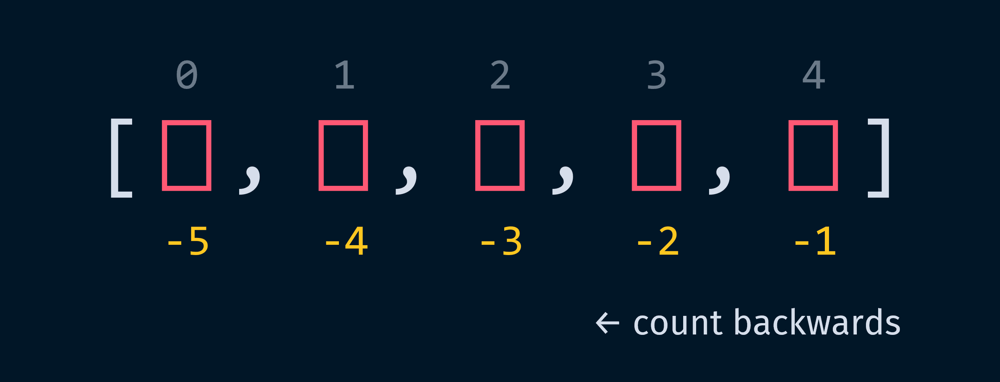
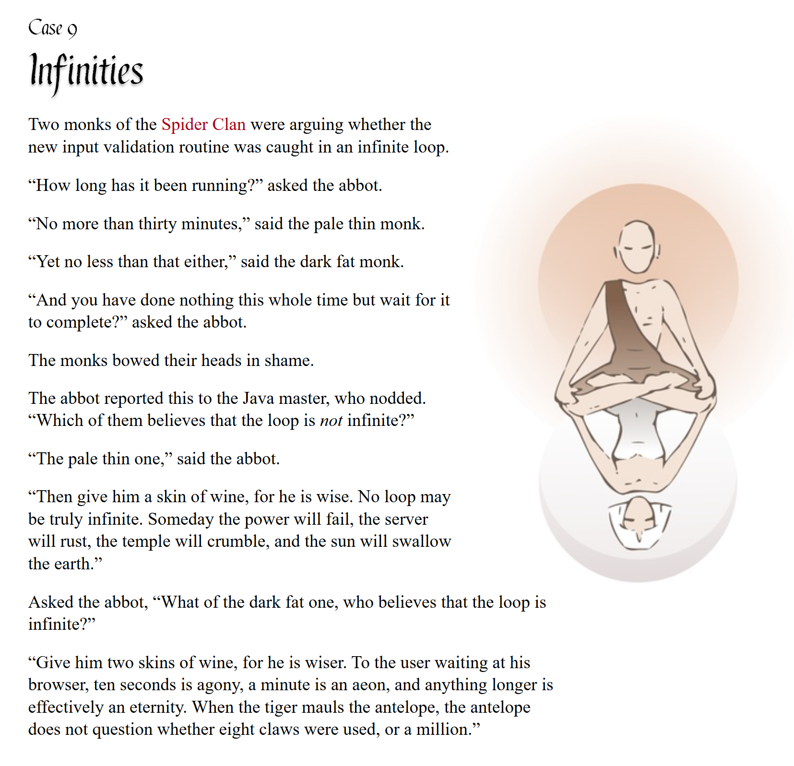

# pycobytes[16] := Slice, Splice, Nice
<!-- #SQUARK live!
| dest = issues/(issue)/16
| title = Slice, Splice, Nice
| head = Slice, Splice, Nice
| index = 16
| shard = syntax / lists
| date = 2025 January 24
-->

> *Computer science education cannot make anybody an expert programmer any more than studying brushes and pigment can make somebody an expert painter.*

Hey pips!

Did you know you can index a list with a negative integer?

```py
>>> l = ["happy", "new", "year"]

>>> l[-1]
'year'
```

Negative indices count *backwards* from the end of the list.



This can often come up in competitive programming, but in general usage you’ll usually only find yourself using it to grab the last element of a list with an index of `[-1]`.

Now wouldn’t it be nice if you could capture multiple elements from a `list` at once?

Well of course, in Python you can! Instead of indexing with a single integer, use 2 integers separated by a colon:

```py
>>> l = [0, 1, 2, 3, 4]

>>> l[1:3]
[1, 2]
```

Hey, doesn’t that look familiar... it’s just like the `range()` function we looked at last issue! Indexing a list follows the same pattern as the arguments to `range()`:

```py
list[index]
list[start:stop]
list[start:stop:step]
```

So, we could grab the even indices from 10 to 20 like so:

```py
>>> l = list(range(100))

>>> l[10:20:2]
[10, 12, 14, 16, 18]
```

Now the `:` is a bit of weird syntactical sugar that you don’t find anywhere else in Python. It actually constructs a `slice` object, which is very similar to `range`.

```py
>>> slice(10, 20, 2)
slice(10, 20, 2)
# stores (start, stop, step) for indexingc
```

But what if we wanted to start at some index, and then continue until the very end of the list? We could compute the ending index:

```py
>>> l = [0, 1, 2, 3, 4, 5]

>>> l[3:len(l)-1]
[3, 4, 5]
```

But this is pretty cumbersome. Luckily, here’s more syntactic magic! You can just leave out the ending index:

```py
>>> l[3:]  # grab every element from index 3 onwards
[3, 4, 5]
```

If you omit `stop`, Python will take it to mean “continue until the end”. The same applies to `start`:

```py
>>> l[:4]  # grab every element up to (but excluding) index 4
[0, 1, 2, 3]

>>> l[0:4]  # identical to above, but less idiomatic
[0, 1, 2, 3]
```

This is really convenient and saves you so much effort computing indices. For instance, if you want to skip every other element:

```py
>>> l[::2]  # start to end, with step 2
[0, 2, 4]
```

And a pretty weird but super useful trick, using a negative step to reverse an iterable:

```py
>>> l[::-1]
[5, 4, 3, 2, 1, 0]
```

With potentially 3 arguments, indexing can get pretty messy. You can try adding whitespace or parentheses:

```py
# absolute horror
l[get_start()+1 if get_start() else 1:get_end()-1:2]

# slightly better
l[get_start()+1 if get_start() else 1 : get_end()-1 : 2]

# much better
l[
    1 + get_start() if get_start() else 1
  : get_end() - 1
  : 2
]
```

But unless your expressions really are short, you’re almost always better off just storing the indices in variables:

```py
s = get_start()
start = s+1 if s else 1
stop = get_stop() - 1

# so much nicer!
l[start:stop:2]
```


<br>


## Further Reading

- More on slicing – [Python Reference<sup>↗</sup>](https://python-reference.readthedocs.io/en/latest/docs/brackets/slicing.html)


<br>


## Challenge

Can you write a function that takes the elements of a list starting at index `n`, reverses them, and then moves them to the front of the list?

```py
>>> l = [0, 1, 2, 3, 4, 5, 6, 7]

>>> your_func(l, 5)
[7, 6, 5, 0, 1, 2, 3, 4]
# 5,6,7 flipped and moved to front
```

(Your function should look a little something like this)

```py
def your_func(l: list, n: int) -> list:
    return ...
```


<br>


---

<div align="center">

[](http://thecodelesscode.com/case/9)

[*The Codeless Code*, Case 9](http://thecodelesscode.com/case/13)

</div>
