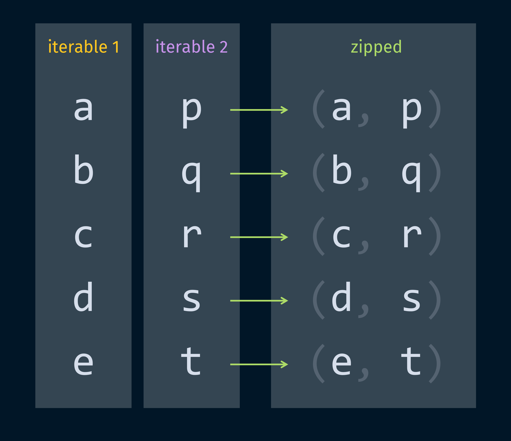

# pycobytes[17] := Zipped and Quipped
<!-- #SQUARK live!
| dest = issues/(issue)/17
| title = Zipped and Quipped
| head = Zipped and Quipped
| index = 17
| tags = functions
| date = 2025 January 31
-->

> *There is only one thing more painful than learning from experience, and that is not learning from experience.*

Hey pips!

You know how Python has a whole lot of useful built-in functions with wonderfully short names?

Well, here’s another one of them – `zip`.

```py
>>> p = [1, 2, 3]
>>> q = ["x", "y", "z"]

>>> list(zip(p, q))
[(1, "x"), (2, "y"), (3, "z")]
```

From a first glance you should hopefully already be able to tell what `zip` does. It takes multiple iterables, and sort of ‘swaps round’ how they’re arranged. In the case of 2 lists, it combines them into just 1 list, with pairs of items from both lists.

But the best way to understand this is for sure to visualise it:



Notice it even reflects why the function is called `zip()` in the first place – it’s like you’re zipping up the lists, bringing both sides together just like you would with a coat zip ;)

We can indeed zip together multiple lists:

```py
>>> r = [None, False, True]

>>> list(zip(p, q, r))
[(1, 'x', None), (2, 'y', False), (3, 'z', True)]
```

A good question to ask is what happens when the lists are of different lengths. Have a think about how you would handle it!

We could only zip up to the length of the shortest list, and omit all the elements in the other lists. We could zip up to the longest, and fill the others in with `None`. We could skip the `None`s and start having tuples with fewer elements. We could just bail and raise an exception.

The thing is, there’s not really a right answer here. It’s up to the language, or the implementors of the language, to define how they want it to behave.

For Python, well, the devs thought of it all. By default, `zip()` stops when the *shortest* iterable has been exhausted. But you can also change how it behaves by setting `strict = True`, or use `itertools.zip_longest()` to stop at the end of the longest iterable.

```py
>>> x = [0, 1, 2, 3, 4]
>>> y = [0, 1, 2, 3, 4, 5, 6, 7]

>>> list(zip(x, y, strict = True))
Traceback (most recent call last):
  File "<stdin>", line 1, in <module>
ValueError: zip() argument 2 is longer than argument 1
```

> [!Note]
> Edge cases like this are an example of why **thorough documentation** is really important. Making sure behaviour is consistent and well-defined makes code more maintainable and debuggable!

Now, we’ve been using `list(zip())` throughout this issue, so you may have already guessed that `zip()` doesn’t return a `list`.

```py
>>> zip(p, q)
<zip object at 0x0000029B87F5C840>
```

Aw yeah, another specialised object!

Why this matters so much here isn’t necessarily storage space. It might be that once we’ve zipped the 2 lists, we won’t need them anymore; so Python’s garbage collector will clean them up and free up that storage. (Note: this is an oversimplification. But garbage collection and references are quite finicky, and for another time.)

The more important thing is *speed*. Imagine you had 2 lists of 10,000,000 items. Pretty hefty. If you wanted to zip these and iterate over them, you could do that manually:

```py
long = list(range(10 ** 7))
lengthy = list(range(10 ** 7))

i = 0
while i < length(long):
    first = long[i]
    second = lengthy[i]
    do_stuff(first, second)

    i += 1
```

That works, but it’s kind of cumbersome to do it yourself, so it’d be nice if we could use `zip()` here.

But imagine if `zip()` had to take the elements from `long` and `lengthy`, and copy them *all* over to a new list, AND construct all the tuples. Pfft. That’d be disastrous.

In time complexity terms, this is `O(n)` (linear time), sure, but for large iterables that’s still a huge amount of work. Once again, the best thing to do is to make `zip()` return an **accessor object** that yields the paired items when *iterated* over.

```py
>>> z = zip(p, q)
<zip object at 0x0000029B87F5C841>

>>> [left * right for left, right in z]
['x', 'yy', 'zzz']
```

What this means is that the zipping doesn’t happen when you call `zip()`, it only happens when you try iterating over it. And it’ll only zip items 1 tuple at a time, so those operations will be spread out over your whole iteration, saving tons of wasted time and overhead.

```py
>>> for i, items in enumerate(zip(long, lengthy)):
        do_stuff(items)

        if i > 20:
            break
            # only zip up to index 21
```

The ease with which you can manipulate iterables, and piece them together in different ways with little to no performance loss, is one of the things that makes Python such a breeze compared to other statically typed languages. (It’s also part of the reason why data engineers like it for data analysis and machine learning!)

That being said, keeping track of the **shapes** of all the objects you’re handling can quickly become a nightmare. We’ll explore some ways we can handle that with type hinting in future issues!


<br>


## Further Reading

- Python’s `zip()` has become even more well thought-out over the years. You can find really well-written details on how you use it in the [Python docs<sup>↗</sup>](https://docs.python.org/3.13/library/functions.html#zip)


<br>


## Challenge

Suppose I give you 2 `list` objects with `int` values, which represent the digits of an integer.

```py
T = [1, 6, 2, 0, 1] # represents 16201
D = [0, 2, 5, 7, 5] # represents 2575
```

Assuming the numbers are small enough so you won’t need to worry about carrying, can you write an expression that adds the 2 numbers via column addition?

```py
>>> (your_expression)
18776
```


<br>


---

<div align="center">

[](https://xkcd.com/1319)

[*XKCD* 1319](https://xkcd.com/1319)

</div>
