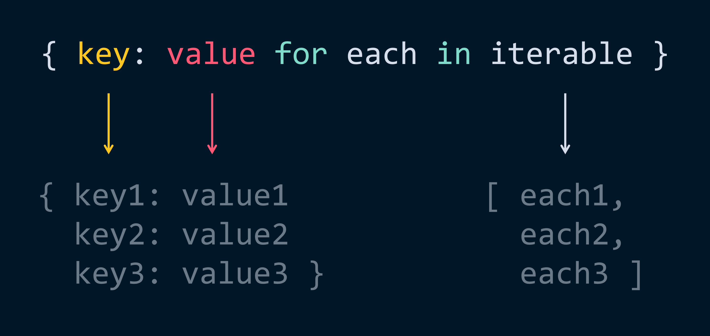
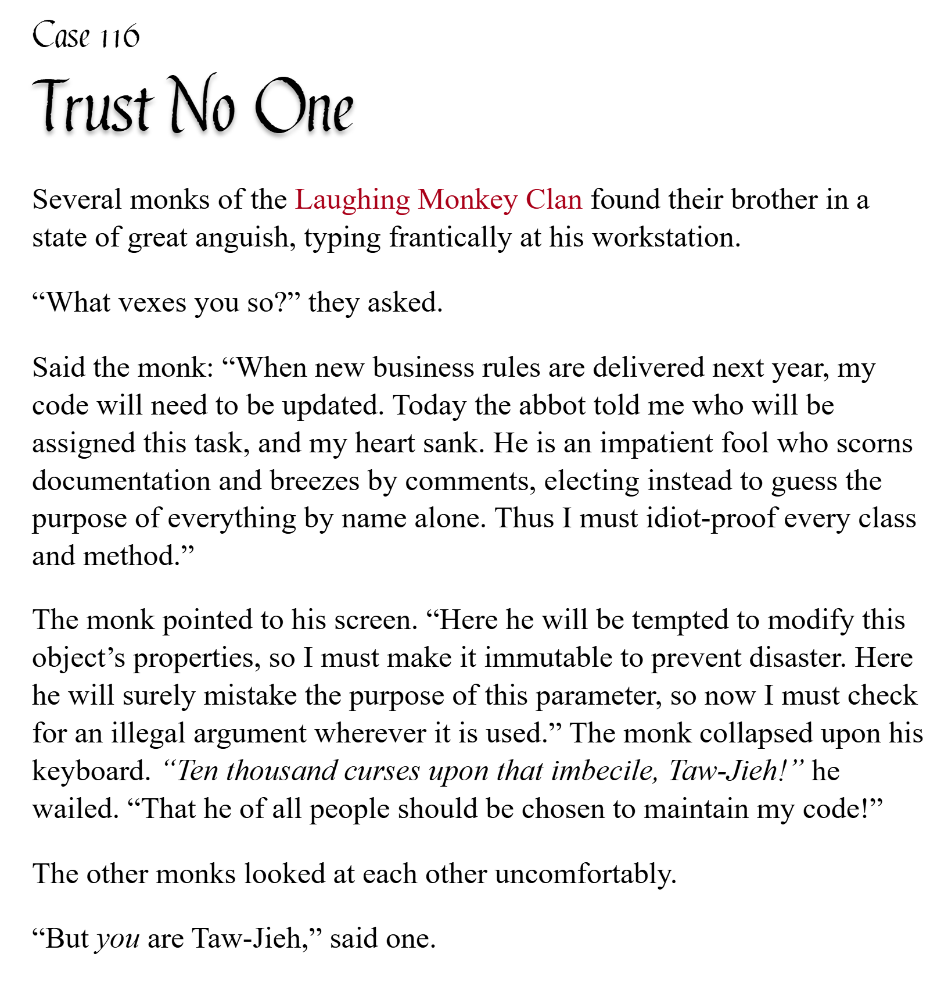

# pycobytes[19] := Dictionary && Set Comprehensions
<!-- #SQUARK live!
| dest = issues/(issue)/19
| title = Dictionary && Set Comprehensions
| head = Dictionary && Set Comprehensions
| index = 19
| shard = dictionaries / syntax
| date = 2025 February 11
-->

> *Sometimes it pays to stay in bed on Monday, rather than spending the rest of the week debugging Monday’s code.*

In the [very first issue of *pycobytes*](01.md) I introduced you to one of Python’s flagship tricks, the list comprehension.

```py
>>> [each.upper() for each in "pycobytes"]
["P", "Y", "C", "O", "B", "Y", "T", "E", "S"]
```

I imagine it won’t come as a surprise that this isn’t restricted to just `list` – dictionary and set comprehensions exist too!

The notation for `set` is identical to `list`, except you swap out the square brackets for curly braces:

```py
>>> {n % 5 for n in range(2, 100)}
{1, 2, 3, 4, 0}
# bear in mind sets are unordered, so this is an arbitrary order
```

Dictionaries, on the other hand, need both a key and value. In another world we’d probably supply these as a tuple `(key, value)`, but luckily our friend Python has once again pulled out some syntactic sugar:

```py
>>> keys = [1, 3, 7, 17]
>>> {each: str(each) for each in keys}
{1: "1", 3: "3", 7: "7", 17: "17"}
# remember numbers can be keys too, even if it’s a bit weird and probably ill-advised
```

So the dictionary comprehension still uses a single iterating variable (we used `each` above) to iterate over an iterable. However, on each iteration, it spits out a `key: value` *pair*, and these are used to construct the final `dict` that’s returned.



Let’s see an example of where you might use a dictionary comprehension. Suppose you have a `list` of usernames, and you’d like to create a `dict` mapping each username to a profile.

```py
import ProfileData from another_file_somewhere
import Blacklist from yet_another_file

usernames = ["Sup2point0", "iTechnicals", "rick-astley"]
data: dict = {}
```

A simple way to do it would be through a loop:

```py
>>> for user in usernames:
        if user not in Blacklist.forbidden:
            data[user] = ProfileData(user)

>>> data
{"Sup2point0": ProfileData(), "iTechnicals": ProfileData()}
```

Alright, cool. But now we can actually condense it into a single-line dictionary comprehension like so:

```py
>>> {user: ProfileData(user) for user in usernames if user not in Blacklist.forbidden}
{"Sup2point0": ProfileData(), "iTechnicals": ProfileData()}
```

Is that cleaner? Hard to say. You save 1 line, but you have a longer line in return.

What this is made for, though, is the situations when you just want to create an object **inline** – without assigning it to any particular variable. For instance, if you’re passing in an argument to a function:

```py
long_and_complex_function(
  some_argument,
  another_argument,
  yet_another_argument,
  config = {
    options: bool(StateManager.get(option) for option in GLOBAL_OPTIONS
  }
)
```

You still could assign that `dict` to a variable, and then pass it in to the function, but when you have many arguments, this could separate where the object’s created and where it’s actually used a bit too much for comfort.

```py
config = {}
for option in GLOBAL_OPTIONS:
    config[option] = bool(StateManager.get(option))

long_and_complex_function(
  some_argument,
  another_argument,
  yet_another_argument,
  config = config,
)
```

As always, it’s certainly not a bad thing to be flexible!


<br>


---

<div align="center">

[](http://thecodelesscode.com/case/116)

[*The Codeless Code*, Case 116](http://thecodelesscode.com/case/116)

</div>
