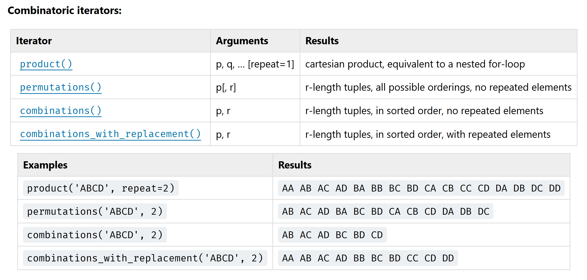

# pycobytes[20] := import itertools
<!-- #SQUARK live!
| dest = issues/(issue)/20
| title = import itertools
| head = import itertools
| index = 20
| shard = modules
| date = 2025 February 14
-->

> *Ask a programmer to review 10 lines of code and they’ll find 10 issues. Ask them to review 500 and they’ll say it looks good.*

Hey pips!

```py
>>> import itertools
```

What’s `itertools`, you might ask?

It’s a standard library which comes with Python. It provides many functions for handling iterables of any kind – hence the name “iter” tools!

Recall that an iterable is any object that can be iterated over (you’ll most commonly be using `list`). Like many other built-in functions we’ve been looking at, the functions in the `itertools` library all return a special *accessor* iterator, rather than a `list`. You can be assured these standard library functions are super-fast and very memory efficient.


So, suppose you wanted to join 2 iterables together and iterate over them at once. With lists we could do

```py
>>> for each in [1, 2, 3] + [4, 5, 6]:
        ...
```

But for other iterables, this could end up problematic for a number of reasons. Maybe you need to guarantee a particular order, or they’re different types, or they just don’t support the `+` operator.

`itertools.chain()` solves this by wrapping all those individual iterables in 1 iterator:

```py
>>> from itertools import chain

>>> it_1 = (0, 1)
>>> it_2 = {7, 6, 5}
>>> it_3 = range(70, 145, 25)

>>> for each in chain(it_1, it_2, it_3):
        print(each)
0
1
5
6
7
70
95
120
```

Now imagine you want to iterate over this in chunks of 3. You could do this with something like

```py
>>> it = list(chain(it_1, it_2, it_3))

>>> for i in range(int(len(it) / 3)):
        first  = it[3*i]
        second = it[3*i + 1]
        third  = it[3*i + 2]
```

It works, but it’s a little cumbersome, especially for much larger batches. `itertools.batched()` is what you’re looking for:

```py
>>> from itertools import batched

>>> for first, second, third in batched(it, 3):
        print(first + second + third)
6
83
215
```

The second argument to `batched()` there is the batch size. And the great thing about using the builtin is that it handles edge cases for you! If the last batch has fewer than 3 items, it will still batch them without complaint. (Of course, this is Python, so you can also disable this behaviour by using `batched(strict = True)`)

> [!Note]
> This is a relatively new function, only added in Python 3.12. You may need to bump your Python version to use it.

Where `itertools` gets *really* cool is the combinatorics functions. These are insanely helpful for Olympiad/competitive programming problems.

For instance, you can generate all the permutations of some number of objects with `itertools.permutations()`:

```py
>>> from itertools import permutations as perms

>>> choices = [0, 1, "s"]
>>> list(perms(choices))
[(0, 1, 's'), (0, 's', 1), (1, 0, 's'), (1, 's', 0), ('s', 0, 1), ('s', 1, 0)]
```

Or if you want only a subset:

```py
>>> list(perms(choices, 2))
[(0, 1), (0, 's'), (1, 0), (1, 's'), ('s', 0), ('s', 1)]
```

Or maybe these are fruit in a bag, and you’re picking a pair without replacement:

```py
>>> from itertools import combinations as combs

>>> fruits = ["apples", "bananas", "jackfruit", "guava"]
>>> list(combs(fruits, 2))
[('apples', 'bananas'), ('apples', 'jackfruit'), ('apples', 'guava'), ('bananas', 'jackfruit'), ('bananas', 'guava'), ('jackfruit', 'guava')]
```

Pretty awesome, right? This table in the [Python docs<sup>↗</sup>](https://docs.python.org/3/library/itertools.html) summarises the different combinatorics functions perfectly:



Make sure to check the docs for `itertools`! There’s a ton of useful and intriguing functions in there waiting to be used ;)


<br>


## Challenge

I have a farm with 66 banana trees. The trees come in 4 exotic varieties:

- 21 trees produce single bananas, worth £0.20
- 20 trees produce boomerang bananas, worth £0.26
- 13 trees produce golden bananas, worth £0.71
- 12 trees produce banana bunches, worth £0.91

(You can confirm with my good friend Quincy if you’re skeptical.)

Every harvest, I collect the produce of 33 randomly selected trees. Each tree has the same chance of being selected. What’s the probability that on a particular harvest I collect more than £20 worth of bananas?

A decimal value is expected, but props if you manage to find an exact value...

> [!Tip]
> You can use `itertools` @.@


<br>


---

<div align="center">

[](http://thecodelesscode.com/case/130)

[*The Codeless Code*, Case 130](http://thecodelesscode.com/case/130)

</div>

