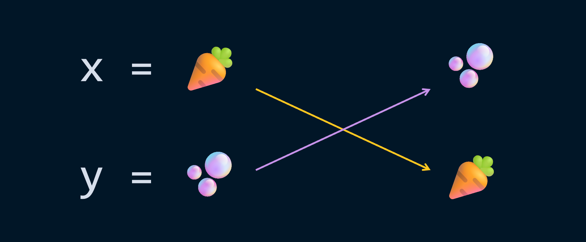
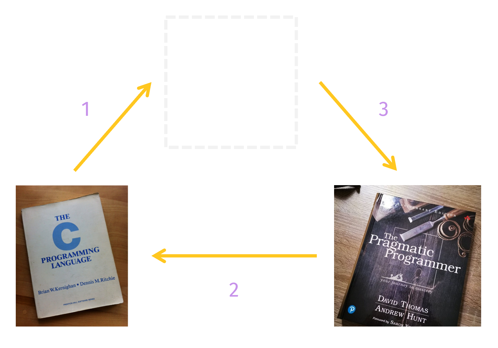

# pycobytes[21] := Quickswap, Swapquick
<!-- #SQUARK live!
| dest = issues/(issue)/21
| title = Quickswap, Swapquick
| head = Quickswap, Swapquick
| index = 21
| tags = quickies
| date = 2025 February 27
-->

> *Walking on water and developing software from a specification are easy if both are frozen.*

Hey pips!

Sometimes life is tough, and you’re faced with the challenge of swapping 2 variables.



In the real world, we’d have, y’know, 2 books on a table or something. To swap them round, we’d move one out the way first, then move the other into its place, and finally put the former where latter had been.



Now that motion really required 3 steps: move book 2 out the way, move book 1 into new position, move book 2 into new position.

If these were variables, that ‘out of the way’ looks like temporarily storing a value in a placeholder variable:

```py
x = 0
y = "swap eternally"

# swap x, y around
temp = y
y = x
x = temp
```

Ahhh, just a bit messy. The single-use `temp` variable might give a lot of programmers shivers. Introducing an extra variable? The horror!!

Well, in the magical world of Python, we can actually instantaneously teleport the books to their new locations without needing extra table space or some surplus variable. It looks exactly how you might expect it to:

```py
x, y = y, x
```

Slick. And guess what, it works with more variables too.

```py
>>> p = 1
>>> q = 10
>>> r = 100

>>> p, q, r = q, r, p

>>> p
10
>>> q
100
>>> r
1
```

Very dapper.

So when you’re doing bubble sort on a list or something, now you know how to swap elements. Just do it in one assignment:

```py
items[i], items[j] = items[j], items[i]
```

But wait, have a careful look at it. Really think about it. Why... does this work?

```py
x, y = y, x
```

It shouldn’t work. If we imagine this as doing 2 assignments, maybe something like

```py
x = y; y = x
```

Well that expands to

```py
x = y
y = x
```

And that doesn’t work, because we lose the value of `x`. When we try to set `y`, the value of `x` has already been changed. Both variables end up becoming `y`.

```py
>>> L = "left"
>>> R = "right"

>>> L = R
>>> R = L
>>> L, R
("right", "right")
```

`x, y = y, x` looks perfectly natural, but it’s actually quite an unnatural mechanic. In fact, you don’t find it in many other languages. So how come it works? What can this mean, other than some more Python trickery... we’ll uncover exactly what’s going on next issue!


<br>


---

<div align="center">

[](https://xkcd.com/1831)

[*XKCD*, 1831](https://xkcd.com/1831)

</div>
