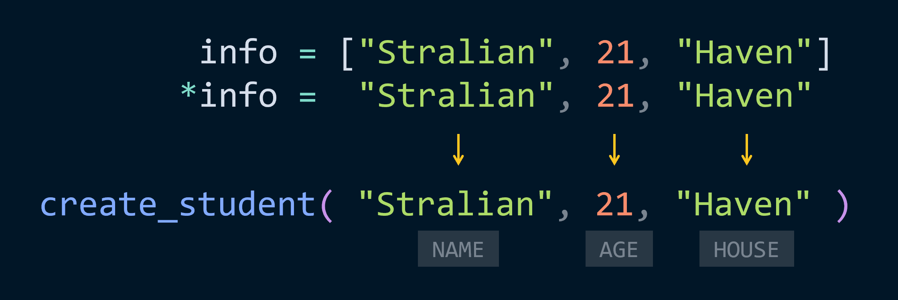

# pycobytes[25] := Snowflakes!
<!-- #SQUARK live!
| dest = issues/(issue)/25
| title = Snowflakes!
| head = Snowflakes!
| index = 25
| tags = syntax
| date = 2025 April 24
-->

> *There are 2 types of people. Those who do backups and those who will do backups.*

Hey pips!

Let’s say we’ve defined a function that takes in 3 parameters:

```py
def create_student(name, age, house = None):
    return {
        "name": str(name).capitalize(),
        "age": round(age),
        "house": house or "unassigned",
    }
```

When we call this, we pass in the arguments individually:

```py
>>> create_student("Stralian", 21, "Haven")
{"name": "Stralian", "age": 21, "house": "Haven"}
```

But suppose we had our items stored in a `list`. How could we pass them to each parameter?

```py
>>> info = ["Stralian", 21, "Haven"]
```

If we just pass `info` to the function, it assigns the whole list to the first parameter `name`, leaving `age` and `house` without values:

```py
>>> create_student(info)
TypeError: create_student() missing 1 required positional argument: 'age'
```

What we want is for the items of the list to ‘spread’ out onto each parameter. We can do this manually by indexing the list:

```py
>>> create_student(info[0], info[1], info[2])
{"name": "Stralian", "age": 21, "house": "Haven"}
```

But sheesh, that’s not ergonomic at all. If we had 5 variables, we’d have to write out all the indices up to `[4]`.

This is another situation where the snowflake operator `*` comes in handy. When used to define variables (function definitions, variable unpacking), it packs many arguments into one – but here it does the opposite, unpacking the values of the list:

```py
>>> create_student(*info)
{"name": "Stralian", "age": 21, "house": "Haven"}
```

To visualise what’s going on here:



So the `*` operator used before an iterable *unpacks* it, turning it from 1 object into a “series” of individual arguments that can be mapped to the parameters of a function. You can also think of it like a magic operator that ‘slices off’ the brackets around an iterable.

This is very much syntactic sugar! You can only use `*` like this between the `()` of a function call. Trying to apply it to an object raw doesn’t work:

```py
>>> stuff = [1, 2, 3]
>>> *stuff
SyntaxError: can't use starred expression here
```

Let’s look at another scenario which illustrates the difference between passing in an iterable argument vs unpacking it with `*`. Our good friend `print()` joins us again. If we print a `list`, it outputs the string representation of the list object:

```py
>>> naturals = [0, 1, 2, 3, 4]
>>> print(naturals)
[0, 1, 2, 3, 4]
```

But if we unpack, then each item of the list is printed individually, with the default space separator:

```py
>>> print(*naturals)
0 1 2 3 4
```

The difference is even clearer if we add a separator:

```py
>>> print(*naturals, sep = " / ")
0 / 1 / 2 / 3 / 4

# no snowflake, no sep
>>> print(naturals, sep = " / ")
[0, 1, 2, 3, 4]

>>> print(naturals, "hi", sep = " / ")
[0, 1, 2, 3, 4] hi
```

Another place we can use this is when constructing a new iterable. If you’ve ever needed to merge lists, you can do so by unpacking them *into* a new one:

```py
>>> list1 = [1, 2, 3]
>>> list2 = [4, 5, 6, 7]

>>> [*list1, *list2]
[1, 2, 3, 4, 5, 6, 7]
```

You could of course just concatenate them with `+`, but if you also have other items, this can make things a lot clearer:

```py
>>> ["first", *list1, *list2, [0, 1]]
["first", 1, 2, 3, 4, 5, 6, 7, None]

>>> ["first"] + list1 + list2 + [[0, 1]]

["first", 1, 2, 3, 4, 5, 6, 7, None]

```

Like many of Python’s quirkier features, the snowflake operator gives us so much flexibility and convenience. It’s something you really come to miss in other languages![^miss]

[^miss]: Thank goodness JavaScript has the spread `...` operator.


<br>


---

<div align="center">

[](http://thecodelesscode.com/case/39)

[*The Codeless Code*, Case 39](http://thecodelesscode.com/case/39)

</div>
