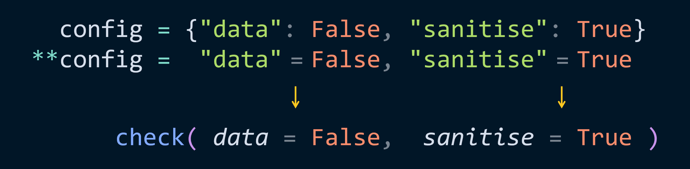
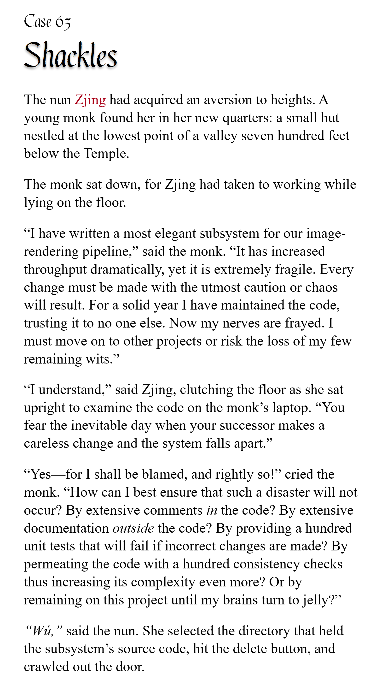

# pycobytes[26] := Merging Dictionaries
<!-- #SQUARK live!
| dest = issues/(issue)/26
| title = Merging Dictionaries
| head = Merging Dictionaries
| index = 26
| shard = syntax
| date = 2025 May 2
-->

> *Nothing is as permanent as a temporary solution that works.*

Hey pips!

We've looked at the snowflake `*` operator a lot, so we can now move onto the *double* snowflake `**`. This is essentially identical to the single snowflake, except it works with *key-value pairs* instead of individual objects.

Where have we seen key-value pairs before? In keyword arguments, of course.

```py
def check(data = None, sanitise = true):
    return str(data).lower() if sanitise else data

check(data = "soup", sanitise = False)
```

And where else? Dictionaries, of course.

```py
config = {
    "data": False,
    "sanitise": True,
}
```

So if we store our arguments in a `dict`, where the keys are the parameters, then we can ‘unpack’ them into the function with `**`.

```py
>>> check(**config)
false
```

Let’s visualise how this unpacking is happening:



If you think of `*` like removing the brackets from an iterable, then `**` removes the `{}` from a `dict` and converts the `:` to `=`.

Again, this is syntactic sugar, and the only places you can use it are function calls. However, constructing a dictionary is akin to calling `dict()`, so we can actually use `**` there!

```py
>>> previous = {"m": 3, "c": 9}
>>> evolved = {"n": "pi", **previous}
>>> evolved
{'n': 'pi', 'm': 3, 'c': 9}
```

This is the fastest way to merge dictionaries in Python – just unpack them into a new one.

```py
>>> d1 = {"red": False, "green": True}
>>> d2 = {"yellow": True, "blue": True}
>>> d3 = {"orange": True, "purple": False}

>>> {**d1, **d2, **d3}
{'red': False, 'green': True, 'yellow': True, 'blue': True, 'orange': True, 'purple': False}
```

The other purpose of `**` is to define **arbitrary keyword parameters**. Remember that `*args` packs all extra positional arguments into one; likewise, to pack keyword arguments together, we use `**kwargs`:

```py
def inspect(start = None, **kwargs):
    print(start)
    return kwargs
```

Any parameters that don’t match with one in the function definition are put in `kwargs`, which becomes a `dict` of parameter-argument pairs.

```py
>>> inspect("whatup", x = 0, y = 1, z = -1)
whatup
{'x': 0, 'y': 1, 'z': -1}
```

Here, `x`, `y`, `z` aren’t explicitly defined in the function parameters, but we do have `**kwargs`, so they’re thrown in the `kwargs` dictionary.

Again, like `*`, the double snowflake `**` *packs* in a function definition, but *unpacks* elsewhere.

Finally, we can see one of the most effective uses of `*` and `**` – forwarding arguments.

```py
def wrapper(*args, **kwargs):
    existing_func(*args, **kwargs)
```

Think carefully about what’s going on here! It’s easy to fall into the trap of thinking `*` and `**` are some strange decorative accessory. (I mean, I guess they are, but also no)

The first `*` and `**` pack the incoming arguments together:

```py
def wrapper(*args, **kwargs):
    # args = [pos1, pos2, ...]

    # kwargs = {
    #     par1: arg1,
    #     par2: arg2,
    #     ...
    # }
```

The second `*` and `**` then unpack those arguments again to the other function call:

```py
def wrapper(*args, **kwargs):
    existing_func(*args, **kwargs)
  # existing_func(pos1, pos2, ..., par1 = arg1, par2 = arg2, ... = ...)
```

Feels a bit like wizardry! But `*` and `**` are really powerful if you understand how they work.


<br>


---

<div align="center">

[](http://thecodelesscode.com/case/39)

[*The Codeless Code*, Case 63](http://thecodelesscode.com/case/63)

</div>
