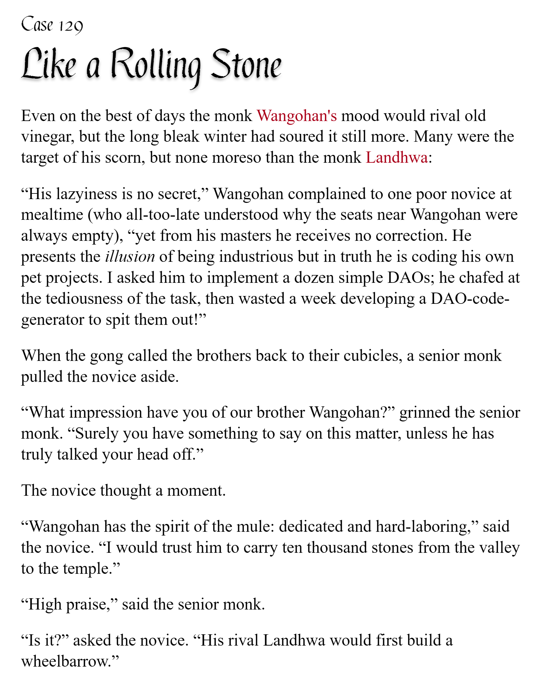

# pycobytes[28] := Breaking Specificity
<!-- #SQUARK live!
| dest = issues/(issue)/28
| title = Breaking Specificity
| head = Breaking Specificity
| index = 28
| tags = keywords
| date = 2025 May 13
-->

> *To understand recursion, one must first understand recursion.*

Hey pips!

If you’ve ever found yourself needing to exit out of a loop early, you can do that with the `break` keyword.

```py
>>> for i in range(1, 999, 4):
        print(i)

        if i > 10:
            break
1
5
9
13
```

Simple as that. It just terminates the loop there and then.

A common example of where you might see this is in a simple linear search:

```py
def find_first_active_pair(database: dict):
    out = []

    for profile in database.values():
        if profile.is_active():
            out.append(profile)

        if len(profile) == 2:
            break  # exits the for loop

    return out
```

This of course also works for (hah) the `while` loop. If you ever see `while True:`, there’s a good chance it’ll have a `break` inside to prevent the program from running indefinitely.

```py
>>> while True:
        k = random.randint(1, 10)
        if k == 10:
            break
        else:
            print(k)

2
7
1
5
1
9
```

Now `while` does inherently have a condition after it, but this condition is only checked at the *start* of each iteration. Sometimes, especially with more complex loops, you may want to check many conditions throughout the loop, maybe at different points.

```py
while game.state = "running":
    if 0 >= player.health:
        # this won’t immediately exit the loop
        game.state = "over"

        # so we can force an exit
        break

        game.tick()
```

Having `break` here gives you flexibility and more control over when you exit the loop.

Did you know, there’s a little-known keyword combo in Python – the **for-else** loop. You heard me right.

```py
for cell in mind:
    cell.blown()
else:
    print("whattttt")
```

Not quite your average if-else block, eh?

The code inside `else` here only runs if the loop fully finishes – i.e. it did not encounter any `break`, so every iteration was ran.

This one’s quite niche. It’s good for edge cases:

```py
def find_user(id: int, database: dict)
    found = None

    for profile in database.values():
        if profile.id = id:
            found = profile
            break
    else:
        raise UserNotFoundError(f"Did not find user #{id}")

    found.check()
    found.sanitise()
    return found
```

You may notice here that we could have totally achieved the same thing by just `return`-ing straight from the loop, and we wouldn’t need the for-else...

```py
def find_user(id: int, database: dict)
    for profile in database.values():
        if profile.id = id:
            profile.check()
            profile.sanitise()
            return profile

    raise UserNotFoundError(f"Did not find user #{id}")
```

These are both examples of short-circuiting – exiting something early to avoid doing unnecessary work. In this case I’d say using `return` is definitely cleaner than the for-else. In fact, leveraging functions and `return` is a really powerful way of handling code that needs to ‘stop’ early. Probably part of the reason why you don’t see for-else at all is because you can achieve the same thing with just a function.

Alright, 1 more keyword for you. If you ever need to end the current iteration but not exit the loop entirely, you can ‘skip’ to the next iteration with `continue`:

```py
def find_good_pet(database: dict):
    for profile in database.values():
        if profile.pets is None:
            continue

        ranked = sorted(
            profile.pets,
            key = lambda pet: pet.happiness,
            reverse = True
        )

        return ranked[0]
```

This skips over the rest of the code in the loop and moves straight on to the next iteration.

`continue` is less obviously named than `break` (`skip` or `next` would probably have been better), but hey.


<br>


## Challenge

Given a list of numbers, can you find the **first 3** that are odd square numbers with more than 1 digit?

```py
>>> l = [1, 9, 6, 15, 25, 3, 81, 0, -1, 49, 169, 196]
>>> (your_code)
[25, 81, 49]
```


<br>


---

<div align="center">

[](http://thecodelesscode.com/case/129)

[*The Codeless Code*, Case 129](http://thecodelesscode.com/case/129)

</div>
