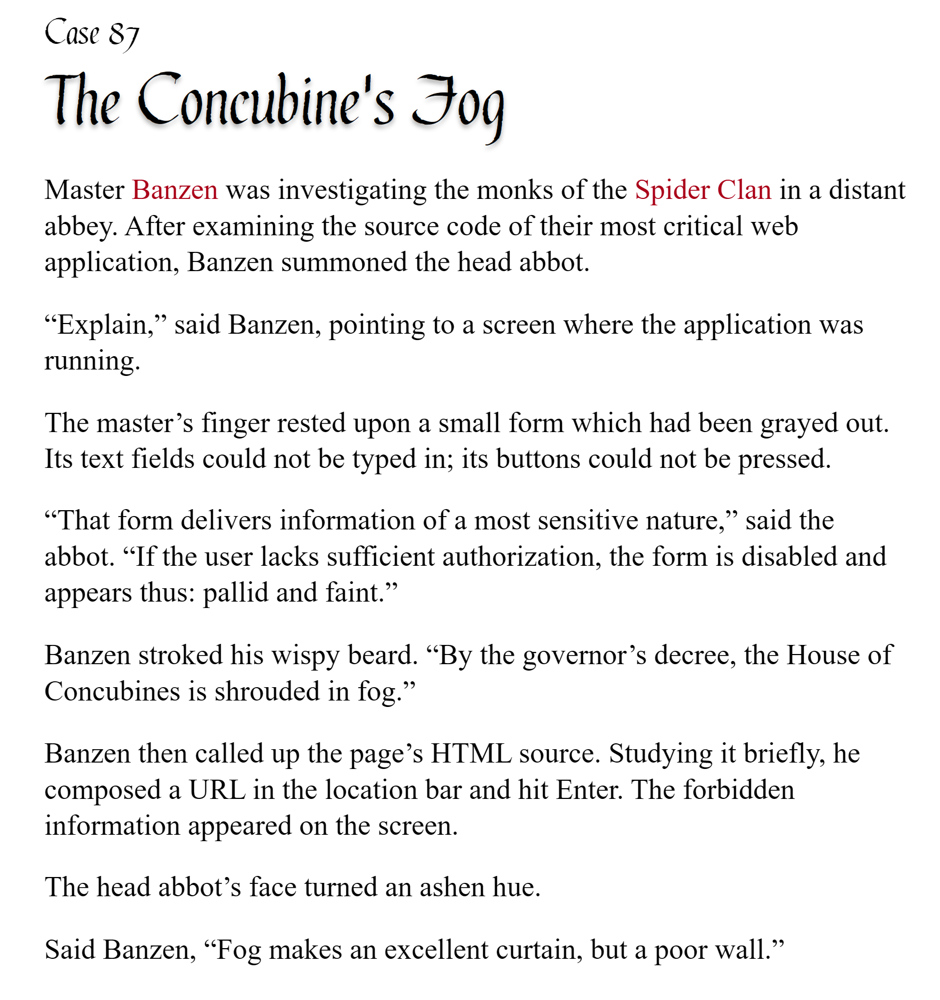

# pycobytes[29] := Expect the Exception
<!-- #SQUARK live!
| dest = issues/(issue)/29
| title = Expect the Exception
| head = Expect the Exception
| index = 29
| tags = 
| date = 2025 May 16
-->

> *A good programmer designs a ship that can't sink, then designs the lifeboats for when it does.*

Hey pops!

Ahh! A syntax error! Nooo!

What’s a `SyntaxError` anyway?

An **error**, technically speaking, refers to anything that’s wrong in your program – unintended behaviour, unsuitable data, inaccurate logic, etc. Some – but not all – errors can interrupt the flow of the program, which you usually see as a crash.

```bash
C:Users/Rick > python main.py
Hello world!
SyntaxError: unmatched ')'
```

When this happens, it means an **Exception** has been raised. If unhandled, these terminate the program and output that lovely error message.

```py
Traceback (most recent call last):
  File "C:/Users/Rick/demo.py", line 39, in <module>
    handler.handle()
  File "C:/Users/Rick/demo.py", line 31, in handle
    respond(*args, **kwargs)
TypeError: handler.<locals>.handle.<locals>.respond() missing 1 required positional arguments: 'status'
```

We call this output a **stack trace**, since it shows all the layers that led to the exception being raised. This is a brilliant tool for debugging, and it’s why other people online will ask for your entire error output (rather than just the single line with the message) when helping you debug.

```py
# what does this mean??
SyntaxError: EOL while scanning string literal
```

You’ve likely encountered plenty of exceptions in your time programming – `IndexError`, `TypeError`, `ValueError`.

It’s inevitable for errors to arise in a program, and this certainty only increases with complexity. Often we overlook error handling when we start out programming, but gracefully and *properly* handling errors is critical in production software.

We can ‘catch’ and respond to errors using **try-except**:

```py
try:
    do_something()
except:
    panic()
```

If an exception is raised while running the code inside `try:`, then that code will terminate, but it won’t terminate the entire program. Instead, the code inside `except:` is ran. Here’s where we can put our error handling.

```py
>>> try:
        l = [0, 1, 2, 3, 4]
        print(l[5])
        l.append(5)  # never happens since previous line raises exception
        print("this never runs")

    except:
        print("l was not long enough, L")

l was not long enough, L
```

We can selectively respond to specific exception types by naming them:

```py
>>> try:
        n = int(input("What would you like to divide by? ))
        print(1 / n)

    except TypeError:
        print("Just enter a number, mate")

    except ZeroDivisonError:
        print("You can’t divide by 0, muppet")

What would you like to divide by? 0
You can’t divide by 0, muppet
```

And Python makes it easy for you to respond to multiple exceptions with the same block – just provide a `tuple` of those you want to catch:

```py
try:
    do_it()
except (TypeError, ValueError):
    failed_to_do_it()
except IndexError:
    database_empty()
```

Remember the for-else loop? We have the same pattern here – an `else:` block under the try-except runs if *no* exception is raised. In other words, the code ran successfully:

```py
>>> try:
        print(0 ** 0)
    except:
        print("okk Python did not like that")
    else:
        print("guess we’re good to go then")

guess we’re good to go then
```

This is different to just putting the code after the try-except, because remember that 

```py
try:
    print(0 / 0)
except:
    print("error")
else:
    print("no error")

print("but this always runs, regardless of error or no error")
```

Even though the exception is thrown, the program as a whole doesn’t stop, because we’ve now got the `except` block absorbing the exception.

We can throw exceptions manually using the `raise` keyword:

```py
try:
    raise TypeError
except:
    print("huh wonder how that happened")
```

Usually this is followed by the `Exception` class (or object) you want to raise, but you can also use it blank:

```py
try:
    if database.empty:
        raise
except:
    print("oh")
```

You’d never actually write the following in production code (I hope), but you might have it as an intermediate during debugging:

```py
try:
    will_go_wrong()
except:
    raise
```

This of course does nothing since it just re-raises the error. But you might, say, comment out your usual error handling code and replace it with a `raise` if you wanted the program to crash and output the stack trace.

```py
try:
    work()
except:
    # if game.state == "idle":
    #     game.nonblock_debug()
    # else:
    #     game.exit_on_error()
    raise
```

And finally, if you need to use the exception you encounter as an object, assign to a variable with `as`:

```py
try:
except IndexError as e:
    print("error encountered")
    print(e)  # outputs error trace
    raise e  # forwards exception
```

These are the basics for expecting and capturing exceptions. How you handle them, of course, is a totally different story. (Pro tip: just printing the exception and ignoring it is NOT the solution.)

In future, we’ll look at how you can define your own exceptions, and use them for sophisticated state and control flow management!


<br>


---

<div align="center">

[](http://thecodelesscode.com/case/87)

[*The Codeless Code*, Case 87](http://thecodelesscode.com/case/87)

</div>

