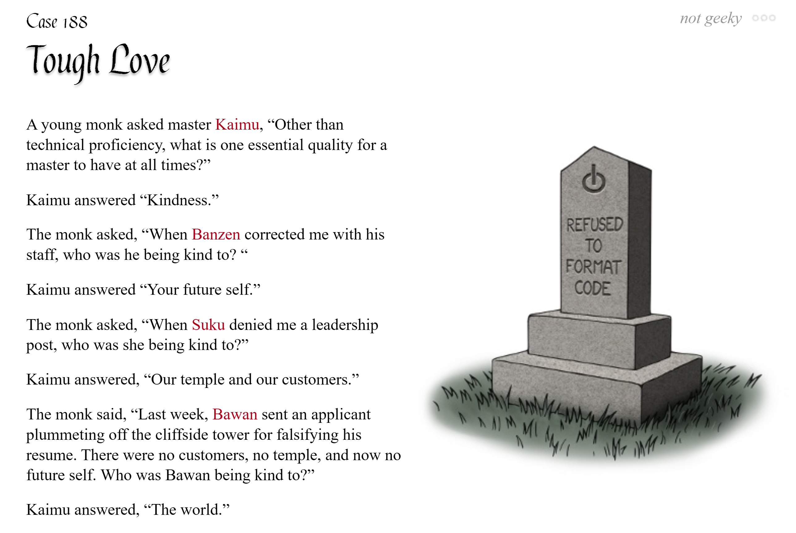

# pycobytes[308] := How do we write maintainable code?
<!-- #SQUARK live!
| dest = issues/(issue)/308
| title = How do we write maintainable code?
| head = How do we write maintainable code?
| index = 308
| tags = special
| date = 2025 July 7
-->

Whatup pips.

Why do we write code?

At surface level, it’s just a means to the end. It’s a tool for creating the product – the program, the app, the website, the game, the API, whatever. And if it works, it works! The code has done its job.

But code is also a language. I mean, they’re called “programming languages” for a reason. So just like human languages, code has syntax, semantics, structure, style; and there are those who write it well, and those who write it less well.

The code embodies the logic and problem-solving that went into creating the product. It conveys the intent, considerations and thought process of the programmer(s) who wrote it. It’s a way of communicating with other software developers. It is very much a living, evolving thing.

This is where good code becomes important. Good, healthy code is the basis for a good, healthy project. But ‘good’ doesn’t necessarily mean the code that’s fastest, or shortest, or even the code that works(!). Those things are certainly desirable qualities, but they don’t automatically equal the best code.

Software development is a careful compromise between readability, simplicity, performance, flexibility, optimisation, development time, development speed, and all the other things that factor in to ‘good’ code.

It’s near-impossible to maximise all of these. This is just the messy world that is reality. By all means, aim for all of them – but remember that often, sacrifices have to be made, and you have to decide what’s important for *you*, in *your context*.

There’s no good way to quantify what makes code ‘good’. One could even argue it’s totally subjective. Above all, however, there is one overarching quality that encompasses all the rest – **maintainability**.

When the code is easy to understand, clear in structure, intuitive to work with, painless to debug, and almost effortless to extend – *pwogh*, you know it’s good.

There are many ways to make your code maintainable. Far too many to cover in depth in one issue. If you care for it, this [GitHub repo↗](https://github.com/charlax/professional-programming) has enough material to last a very, very long time.

Some of the techniques are major changes – modularisation, type hinting, documentation – but many more are the little things – identifier naming, line-breaking, shifts in how you think about writing code. At the end of the day, you should constantly ask yourself: “What’s the clearest way to write this code? How can I make it easily understandable, usable and extensible for future developers?”

Writing maintainable code is not easy. It requires constant and *consistent* effort, in every line you write, every function you define, every class you construct. You’re eternally battling entropy, fighting against the rot of low-effort, buggy, scuffed, hacky, sketchy, and fragile code.

Sometimes, it’s better to spend more time and effort writing a good solution than immediately settling for the first thing that works. “If it ain’t broke, don’t fix it”, sure, if it’s bad code, it will break. Sooner or later.

In the very first issue of *pyco:bytes*, the quote was: “Code is read far more than it is written.”

If you haven’t felt this yet, you will one day. Trust. You can’t write new code unless you understand the code that’s already there. And if you write code without a thought for its quality, you’re setting yourself up for failure.

Throughout *pyco:bytes*, I’ve shown you all sorts of cool features and tricks of the Python programming language. My aim was to equip you with the fluency, flexibility, and depth of knowledge to rise above the intermediate level most tutorials tend to leave you on.

By no means will all of these be useful all the time. Some will no doubt become ingrained in how you write code, like list comprehensions and f-strings; some you might never touch, until you encounter that one unlikely edge case where it happens to perfectly fit your problem.

Above all, it’s **context** that should inform and influence what’s the best approach in a given situation. That judgement and intuition comes from time, experience, and making mistakes.

Anyone can write code a computer can understand. A good programmer writes code that a *human* can understand.

> [!Warning]
> Of course, there is the ever-looming question of whether all this matters with the current explosive developments in AI. But this isn’t really the place for that discussion. I’ll take it if you’re reading pycobytes, it’s cuz you love Python and want to write better code.

 

---

[*The Codeless Code*, Case 188](http://thecodelesscode.com/case/188)

