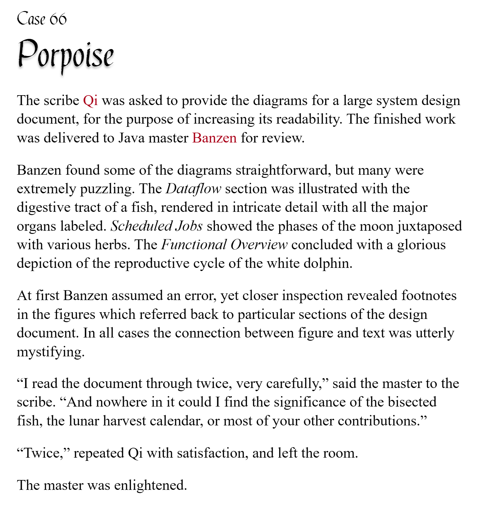

# pycobytes[31] := Programmers Are Lazy
<!-- #SQUARK live!
| dest = issues/(issue)/31
| title = Programmers Are Lazy
| head = Programmers Are Lazy
| index = 31
| tags = keywords
| date = 2025 June 5
-->

> *There are two ways of constructing a software design. One way is to make it so simple that there are obviously no deficiencies. The other is to make it so complicated that there are no obvious deficiencies.*

Hey pips!

Check out this list comprehension:

```py
>>> [(x**n) % (n-1) for n in range(2, 10**10) for x in range(2, 1000)]
...
```

Now that’s a massive list right there. Computing it is gonna take a while, to say the least, and it’s almost certainly not fitting in memory.

We’ve see that `range` is very efficient even with large numbers because it computes values on the fly. We want the same thing here, where the iterable only produces the values when they’re needed.

This is a form of **lazy evaluation**, and Python has a neat construct just for it. Turn your square brackets into round parentheses, and you’ve got yourself what’s known as a **generator expression**.

```py
>>> (mod(x ** n, n-1) for n in range(2, 10**10) for x in range(2, 1000))
<generator object <genexpr> at 0x00000204F8F45030>
```

Like its name suggests, this object *generates* values one-by-one as they’re needed. The key difference between a generator and, say, a `list`, is that a generator doesn’t store the actual values – it only computes them when asked for them.

```py
firsts = (row.get_first() for row in table)
```

What does this mean? Well, it makes generators very memory-efficient, especially for long collections – only a single element has to be kept in memory, instead of the entire collection. In fact, this also allows generators to be infinite! You can just keep asking them to compute values indefinitely.

So, how do we fetch those values?

Well, generators are iterators (there is a distinction, it’s very technical tho icl), which means you can call `next()` on them to access the next element in the iterable:

```py
>>> netherlands = (n ** 0.5 / 2 for n in range(0, 314))
>>> next(netherlands)
0.0
>>> next(netherlands)
0.5
```

But 99.7% (3 sf) of the time, you’re just iterating over them with a `for` loop.

```py
>>> netherlands = (n ** 0.5 / 2 for n in range(0, 314))
>>> for n in netherlands:
        if n > 1:
            break
        print(n)
0.0
0.5
0.7071067811865476
0.8660254037844386
1.0
```

> [!Tip]
> Under the hood, the `for` loop is just repeatedly calling `next()` on the iterable, until the iterable is exhausted.

Generator expressions are convenient, but they’re actually syntactic sugar for the more fundamental underlying mechanism – **generator functions**.

A generator function, instead of `return`ing a single value, uses a different keyword `yield` to return multiple values.

```py
def generate():
    yield "never"
    yield "gonna"
    yield "give"
    yield "you"
```

If it makes it easier to understand at first, you can think of `yield` like a `return` that doesn’t stop execution – instead the function keeps running, and each `yield` adds another value to an output iterable.

But um, akshually, generator functions are a lot weirder than that... What really happens is `yield` returns the value, and then *pauses* the function.

Yeah, it’s wack.

> [!Tip]
> This is difficult to explain, so you may wanna do your own research to help you understand it.

We’ll start by adding some print statements to a generator function to track what’s happening:

```py
def source():
    print("gen: STARTING UP")

    print("gen: YIELDING 1")
    yield 1
    print("gen: YIELDED")

    print("gen: YIELDING 2")
    yield 2
    print("gen: YIELDED")

    print("gen: WRAPPING UP")
```

When we iterate over this generator function in a `for` loop, the `for` loop is continually calling `next()` on the generator:

```py
for each in source():
    do_shenanigans()

# essentially:
items = source()
each = next(items)
do_shenanigans()
each = next(items)
do_shenanigans()
...
```

Each time it calls `next()`, the generator function resumes execution until it encounters a `yield`. It then passes that yielded value to the `for` loop, which assigns it to your iterating variable.

```py
def source():
    print("gen: STARTING UP")

    print("gen: YIELDING 1")
    yield 1  # returns and pauses
    print("gen: YIELDED")  # not run!

    ...
```

```py
for each in items:
    # first value becomes 1
```

Then the body of the `for` loop runs, and when it’s done, the `for` loop calls `next()` on the generator again. The generator picks up where it left off (and remembers all the state!), runs until it `yield`s the next value, passes it to the `for` loop, and so on.

```py
>>> for each in source():
        print(f"for: RECEIVED {each}")

gen: STARTING UP
gen: YIELDING 1
for: RECEIVED 1
gen: YIELDED
gen: YIELDING 2
for: RECEIVED 2
gen: YIELDED
gen: WRAPPING UP
```

Notice how the `gen: YIELDED` don’t print *before* the `for` loop says it received the value, but *after*. When the generator function `yield`s a value, that’s when execution is suspended and control is passed back to its caller.

```py
gen: STARTING UP
gen: YIELDING 1  # generator yields and pauses
for: RECEIVED 1
gen: YIELDED     # generator continues
```

Whew. Lot to take in. If you manage to understand it (don’t worry, it takes time), this pretty intuitively explains why generators can only produce values *in order*.

It’s got that sequence of a `yield` statements with potentially anything in between, so each yielded value depends on all the ones before it. You can’t use random access[^rand-access] (indexing) like with a list, because computing element `42` requires computing `0:41` too.

[^rand-access]: I thought I’d lied because I hadn’t told you about `itertools.slice()`, but it turns out that doesn’t random access, it literally computes all the values leading up to the first value you want 💀

> [!Warning]
> This would also explain why `range()` and `zip()` aren’t generators, just more general iterators – they do allow indexing, so don’t have to be iterated over in order.

All in all, I’m sure you’ll come to appreciate the beauty of generators as you solidify your understanding of how they work. At heart, they’re just lazy-loading iterables – it’s literally like Minecraft loading in chunks as you move in the world.

In fact, you’ve probably already seen a nonzero number of built-in functions in Python that are generators. `open()` is a common one, returning an object that yields the lines of the file when iterated over. If you were reading a 270,000-line .csv file into memory, that would be disastrous, so it’s a good thing the generator only loads it line-by-line!


<br>


## Further Reading

- High-quality tutorial on generator functions and expressions – [mCoding<sup>↗</sup>](https://youtube.com/watch?v=tmeKsb2Fras)
- Generators across programming languages – [Wikipedia<sup>↗</sup>](https://wikipedia.org/wiki/Generator_(computer_programming))


<br>


## Challenge

Can you write a 1-line expression that generates [perfect](https://wikipedia.org/wiki/Perfect_number) numbers?

```py
>>> perf = (your_expression)

>>> [next(perf) for i in range(4)]
6 28 496 8128
```

Your expression should be able to generate infinite numbers, in theory.


<br>


---

<div align="center">

[](http://thecodelesscode.com/case/66)

[*The Codeless Code*, Case 66](http://thecodelesscode.com/case/66)

</div>
