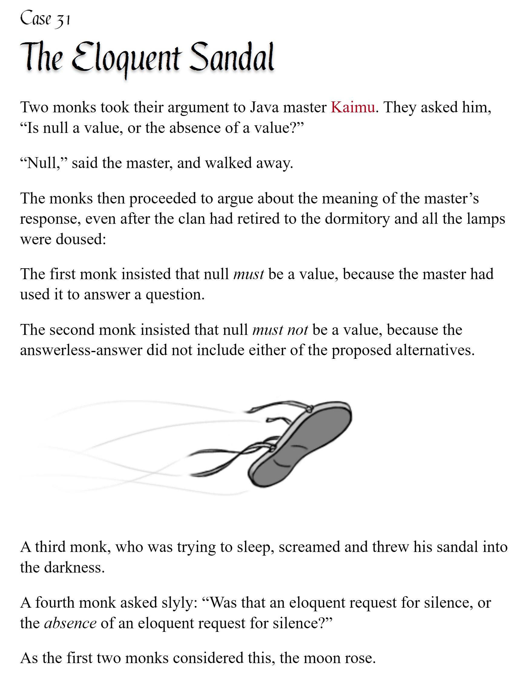

# pycobytes[33] := What even is a function?
<!-- #SQUARK live!
| dest = issues/(issue)/33
| title = What even is a function?
| head = What even is a function?
| index = 33
| tags = technical
| date = 2025 June 20
-->

> *Perfection is achieved not when there is nothing more to add, but when there is nothing more to take away.*

Hey pips!

Python is, famously, an **object-oriented** programming language. I’ll assume you already know how to create your own `class`es and instantiate objects – they’re usually the endpoint of Python courses, and are better covered by a video tutorial than any written one.

> [!Note]
> I originally planned an entire sequence of issues on objects, `__dunder__` methods, `__slots__`, the whole rabbit-hole, butttt we’re outta time, so I’d rather not rush or condense those.

Once you fall into the object-oriented paradigm, it kinda becomes hard to see how a programming language could be anything else, because objects just *make sense*.

Here’s how it works: **Everything is an object.**

Yeah, literally.

Ok, not quite *everything* everything, but linguistic syntax aside, all of programming in Python is just dealing with objects. Defining them, creating them, mutating them, passing them around, interacting with them, all that.

There’s no good angle of attack for this, so I’ll just throw us straight in the deep end here. Functions? Yeah, those are objects. (In Python, at least.)

```py
def hallucinate():  # <—- this is an object!!
    print("huh")
```

Seems sus? Well, have you never wondered what typing a function without the parentheses does?

```py
>>> hallucinate  # look ma, no brackets
<function_object>
```

👀

That’s an object right there. Notice we didn’t call the function, cuz no `huh` was printed – you’d need `()` for that. We’re just referencing the function, the function *object*.

Like any object, you can assign functions to variables, pass them into other functions, and store them in containers.

```py
my_var = hallucinate

my_func(hallucinate)

my_stuff = [hallucinate, hallucinate, hallucinate]
```

Really, functions are just a special kind of object that you can do `this_object()` on – i.e. they can be called with `()`. This property just happens to be so fundamental in programming that we give these types of objects an individual name.

> [!Note]
> If looking at `__dunder__` methods, any object that defines a `__call__()` method is callable... and so could be called a function. But then if you wonder how `__call__()` can be a function, since it would needs its own `__call__()` (it doesn’t, it’ll be implemented in C), it just becomes a rabbit hole down to the lands of Assembly.
>
> The ground truth is that some features of the language are atomic in Python, like how (to our current physical understanding) quarks can’t be broken down further.

One quick detour before we continue. When you learn how to code, you’re introduced to “variables”. I don’t really like this term, because it’s rather misleading. In the example above, what’s `hallucinate`? Would you call it a variable? It certainly looks like one, but I thought it’s also a function? Can you ‘call’ a variable like `this()`? Are functions and variables the same?

I find **identifier** is a much more robust and non-arbitrary term. `hallucinate` is the identifier – i.e. the literal text you type – to refer to the function *object* that it represents. Like here, `sup` is a way of referring to the object `2`:

```py
sup = 2
```

And if we assign `sup` to another identifier `soup`:

```py
>>> soup = sup
```

Then `soup` is now also an identifier for the same object `2`.

```py
>>> soup is sup
True
```

Importantly, `soup` does *not* store the ‘variable’ `sup` at all. The two identifiers are unrelated. They just store the same *object*, the number `2`.

So back to functions. When we define a function, the `def` syntax binds it to an identifier:

```py
def roll():
    print("yooooooooo")
```

And when we call that identifier, we call the function.

```py
>>> roll()
yooooooooo
```

We can give the function a new identifier by assigning it to... that new identifier!

```py
>>> roll_faster = roll
>>> roll_faster()
yooooooooo

# another one
>>> roll_harder = roll
>>> roll_harder()
yooooooooo
```

This doesn’t ‘rename’ the function or anything. All it’s doing is assigning the function object to more than 1 identifier.

```py
# these now all refer to the same function
>>> roll()
yooooooooo
>>> roll_faster()
yooooooooo
>>> roll_harder()
yooooooooo
```

Where might this be relevant? Well, maybe your function isn’t defined already, but is *returned* by another function...

```py
def mob_spawner():
    def output_func():
        print("AHHHHHHHHH")

    # returns the function object
    return output_func
```

Oh yes, if functions are objects, then there’s nothing stopping functions from returning other functions >:) So now, we can assign the output to an identifier (variable), and then call it:

```py
>>> spawn = mob_spawner()
>>> spawn()
AHHHHHHHHH
```

Weird much, eh? And yes, this does mean if you wanted to immediately call the output, you’d do this...

```py
>>> mob_spawner()()
AHHHHHHHHH
```

Don’t worry, it’ll get even weirder when we look at decorators. Functions returning functions that take in functions to return decorated functions. Don’t we love objects.

Of course, I think it’s still totally fine to refer to variables as, well, variables. This is the expected terminology. However, I think it’s worth appreciating that you can store *any* object in a variable – this includes functions, classes, modules, and more – and in this sense, thinking of them as “identifiers” can help break any misconceptions you might hold.


<br>


---

<div align="center">

[](http://thecodelesscode.com/case/31)

[*The Codeless Code*, Case 31](http://thecodelesscode.com/case/31)

</div>
