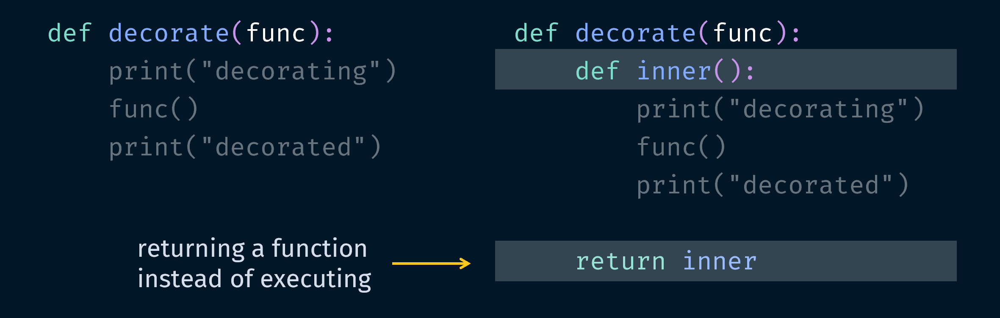

# pycobytes[35] := Wrapping Up
<!-- #SQUARK live!
| dest = issues/(issue)/35
| title = Wrapping Up
| head = Wrapping Up
| index = 35
| tags = functions
| date = 2025 July 2
-->

> *A good programmer looks both ways before crossing a one way street.*

Hey pips!

Suppose we’d like to debug a function by printing each time it’s ran, once before and once after.

```py
print("presenting")
present()
print("presented")

print("presenting again")
if present():
    print("present perfect")
```

This is pretty messy. Maybe we could write a utility function to clean things up a bit.

```py
def debugged_present():
    print("presenting")
    present()
    print("presented!")
```

Of course, `print()` here is really an analogy for anything you might want to do before or after the function – maybe you've got some data to validate, logs to add the call to, or signals to send.

What we've written is a wrapper function. Its purpose is the same as `present()`, it just ‘wraps’ it with extra fluff.

```py
>>> debugged_present()
presenting
# present()
presented!
```

So what if we wanted to wrap *any* function, not just `present()`?

Hopefully your brain is already tingling. Since functions are objects, we can just pass in whatever function we want to wrap, as an argument!

```py
def wrap(func)
    print("wrapping")
    func()
    print("done")
```

Now we could pass in any function, and have the prints added to it:

```py
>>> wrap(lambda: print("love it"))
wrapping
love it
done
```

But this is a bit impractical, because every time we want to call the function, we need to pass in the original to `wrap()`. What we really want is a *permanently transformed* variant of the function – and ideally, we wouldn't even need to change its name to that of the wrapper.

The key to this all lies in manipulating functions as objects. First, remember that using `def` binds a function object to an identifier. But there's absolutely nothing stopping that identifier from being reassigned – it's really just a variable, right?

```py
>>> def polymorphic():
        return "You’ll never take me alive!"

>>> polymorphic = True
>>> polymorphic
True
>>> polymorphic()
TypeError: 'bool' object is not callable
```

And secondly, we can return any object from a function, including *another* function. To illustrate, here’s defining a function inside a function:

```py
def wack():
    print("isn't this weird")

    def utility(target):
        return target.upper()

    # return the function
    return utility
```

A function defined inside another function like this can be called a **closure**, and it's interesting because the inner function has access to the locally scoped variables of the outer function.

By that, I mean `inner()` here can access the parameter `x`.

```py
def outer(x):
    def inner():
        return x

    return inner
```

Compare this with if they were split. Then `inner()` can't access a scoped variable of `outer()`!

```py
def outer(x):
    return x

def inner():
    return x  # nonexistent!
```

Indeed, there's some weird stuff going on when you nest functions.

So back to wrapping, this gives us the extremely helpful **decorator** pattern. Here's what it looks like:

```py
def decorate(func):
    def inner():
        print("decorating")
        func()
        print("decorated")

    return inner
```

Ok, make sure you look carefully to see what’s happening. We’re nesting a function `inner` inside the decorator function, which does exactly the same thing as `wrap` earlier. The difference here is we’re defining a *new* function, then returning that function object.



What we’ve created is a function that can transform other functions. Let's see it in action:

```py
>>> def sq():
        print([i**2 for i in range(4)])

>>> sq = decorate(sq)

>>> sq()
decorating
[0, 1, 4, 9]
decorated
```

In maths, functions are machines that take in numbers and spit out other numbers. But in code, they can also take in functions, and spit out new functions!

Wrappers allow us to easily surgically modify arbitrary functions. This is made even more convenient by Python’s decorator syntax using `@`.

```py
@decorate
def mind_blown(really = False):
    return True
```

The above is a shorthand for:

```py
def mind_blown(really = False):
    return True

mind_blown = decorate(mind_blown)
```

So you use `@` and supply the identifier of the wrapper to apply. Notice you’re not calling the wrapper – it’s not `@decorate()`. You’re telling Python which function object to use as the wrapper.

> [!Tip]
> To avoid confusing those who are new, I won’t dive deep into using `@decorator()`. If you’re curious, this is actually a common pattern. What you’re doing is calling *yet another* function that then supplies the wrapper. This looks like 2 levels of function nesting, with 2 function returns at the end. It’s quite trippy (and funny), but it does make sense. At the end of the day, all `@` expects is a function object, and you could get that object in many different ways, one of which is being returned by a function.

But wait, what if your function takes parameters? `inner()` was defined without any, and since `decorate()` replaces `mind_blown` with `inner`, now all our parameters are gone.

```py
>>> mind_blown(really = False)
TypeError: decorate.<locals>.inner() got an unexpected keyword argument 'really'
```

But we also can’t know the signature of `mind_blown` in advance, since, well, it could be any function being passed in.

The solution is to accept arbitrary arguments, and forward all of them straight to the original function. Works like a charm!

```py
def decorate(func):
    def inner(*args, **kwargs):
        print("decorating")
        func(*args, **kwargs)
        print("decorated")

    return inner
```

Oh yeah, and make sure you actually return whatever your original function returns. If you’re injecting code to run after the original function finishes, just store it until the end of the wrapper.

```py
def decorate(func):
    def inner(*args, **kwargs):
        print("decorating")
        out = func(*args, **kwargs)
        print("decorated")

        return out

    return inner
```

That's your archetypal decorator layout right there.

Python actually has a couple of built-in decorators. For instance, when defining your own classes, `@staticmethod` is used to mark methods as static, and `@property` is used to define property getters.

```py
class BugInvader:
    @staticmethod
    def explode_all():
        ...

    @property
    def population():
        ...
```

Behind the scenes, these are doing what we saw above, transforming the functions to give them different properties.

Decorators are honestly a really cool feature for flexibility and modularity, especially in large, complex projects. I don’t often find myself needing them, but for the select cases where you do, it’s a joy to use.


---

<div align="center">

[](https://xkcd.com/2200)

[*XKCD* 2200](https://xkcd.com/2200)

</div>
