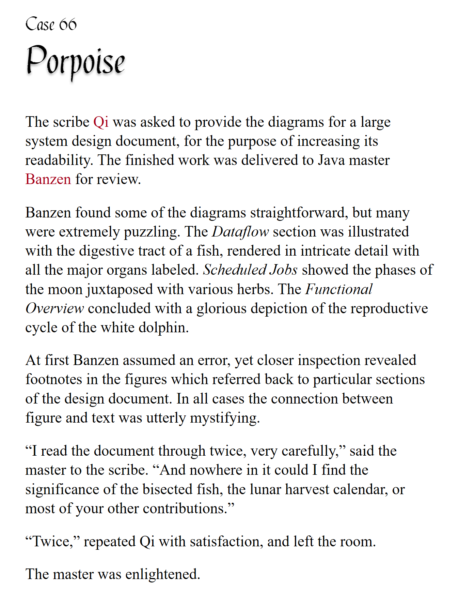

# pycobytes[36] := Typical Typist is Typing...
<!-- #SQUARK live!
| dest = issues/(issue)/36
| title = Typical Typist is Typing...
| head = Typical Typist is Typing...
| index = 36
| tags = syntax
| date = 2025 July 6
-->

> *Give someone a program, and they’ll be frustrated for a day. Teach someone to program, and they’ll be frustrated for a lifetime.*

Hey pips!

Python is known for being an easy, flexible language, great for picking up the fundamentals of coding.

One of the ways in which Python’s more flexible than other languages like C, C#, Rust, Go is that it’s **dynamically typed**. This means that

1. You don’t need to ‘declare’ variables with an explicit type.
2. Variables aren’t ‘permanently’ constrained to a particular type.

For instance, in statically typed languages, once you’ve declared a variable to be an integer, you now can’t assign a string value to it.

```cs
int x = 0;
x = "it was at this moment that we knew";  // nope
```

But in Python, we’re free to assign whatever values we want to variables, and we can even change the type if necessary.

```py
>>> flex = None
>>> flex = "what’s"
>>> flex = ["good"]
```

This flexibility isn’t *necessarily* guaranteed to be a good thing. As Uncle Ben said, “with great power comes great repositories” (sauce: trust me bro).

The important thing is to *properly manage* your types. Dynamic typing doesn’t mean you don’t care about types at all! It just allows you to be a bit more lax with them, which can make development less cumbersome.

> [!Warning]
> But if you neglect proper type management, then the opposite happens – you end up with `TypeErrors` and mismatched variables all over the place that become increasingly impossible to fix.

Throughout *pyco:bytes* issues, you may have noticed me labelling types when initialising variables or defining parameters. This feature is known as **type hinting**, or **type annotations**.

```py
def parse(source: list[str], out: str) -> (str, int):
    data: dict = load_data(source)
    ...
```

For a variable or parameter, add `:` after the identifier, and then name the class its value should be an instance of.

```py
text: str = "never gonna give you up"
label: int = 1984
sunglasses: bool = True
```

And for a function, you can indicate the type of the value it returns using an `->` after the definition:

```py
def ticktolling() -> list:
    ...
```

You can use any built-in type, imported classes, your own defined classes – anything that an object can be an instance of.

```py
class Phone:
    ...

model: Phone = buy_phone(make = "nothing")
```

These type annotations provide a way of indicating what type an object should be in Python.

BUT! They **do not** actually affect the code in any way.

At all. They make zero difference! The program still runs identically, as if the type hints weren’t there at all.

In fact, type hinting isn’t even enforced. You can mark a variable as a `set`, and then assign a date to it...

```py
>>> import datetime
>>> dubious: set = datetime.date(1984)
```

How ridiculous. Well, they did say Python’s flexible!

So if it doesn’t do anything, what’s the point of type hinting then??

Well, it may not affect the code, but it *can* affect how the code is *developed*. Type hinting isn’t for the program – it’s for the developers.

When you look at code written by someone else (or, equivalently, by yourself any time longer than a couple months ago) with loads of variables and functions, no matter how well-named the identifiers might be, it’s gonna be tough to figure out what their exact types are.

> [!Note]
> Ignore the edge case where someone has named their identifiers *with* the type, like `list_of_str__get_items()`. This is generally terrible practice, and hugely inefficient.

This is what type hinting helps solve. It’s a form of **documentation** – *internal* documentation – that helps make the code clearer, less ambiguous, and more accessible. Developers reading the code can be certain what types of objects they should be passing into functions, and what they can expect to be returned back.

```py
def complex_api_interaction(
    context: APIContext,
    client: AppClient,
    request: Request,
    request_headers: Request.Headers = None,
    timeout: bool = True,
    max_attempts: int = 1,
) -> Model:
    ...
```

Functions and classes are definitely the most important places for type hinting, where you want to be crystal-clear what types of arguments they’re expecting.

IDEs nowadays have the fantastic feature of showing the type of an object when you hover over it – and that comes from type hinting! So if you annotate types for all your classes, now throughout the project you can check the types of those objects’ attributes, and check all the interactions are working as expected.

```py
class GameObject:
    object_id: int
    display_name: str
    children: list[GameObject]
    alive: bool
```

One last thing – there is one circumstance where type annotations do technically make a (syntactic) difference. They allow you to type hint a variable without initialising it:

```py
what: bool
```

If you remove the `: bool`, this is no longer valid syntax:

```py
what  # SyntaxError
```

`what` isn’t a defined identifier, so you can’t just refer to it as a standalone statement. We need the `: bool` type hint to make the syntax valid.

Heads up tho, `what` still does not actually exist. Try using it:

```py
>>> what
NameError: name 'what' is not defined
```

Type hinting it does not create or initialise the variable, but after it is assigned a value, it will now have that type hint.

This is relevant in classes, where you may want to declare the members of that class and their types cleanly in the class body, instead of the constructor:

```py
class Last:
    lasting: bool
    future: bool

    def __init__(self, lasting, future):
        this.lasting = lasting
        this.future = future
```

It’s now obvious with a quick glance which attributes `Last` has.

You really can’t go wrong with type hinting. As the [Zen of Python<sup>↗</sup>](https://peps.python.org/pep-0020/) says, “explicit is better than implicit”. If you look at the docs or source code for any library, large or small, they’re almost guaranteed to have type hints in their functions. Adding types to your code makes so much easier to work with it – both for other developers, and yourself.


<br>


## Further Reading

- A type hints cheat sheet on the [mypy docs<sup>↗</sup>](https://mypy.readthedocs.io/en/stable/cheat_sheet_py3.html).


<br>


---

<div align="center">

[](http://thecodelesscode.com/case/66)

[*The Codeless Code*, Case 66](http://thecodelesscode.com/case/66)

</div>
