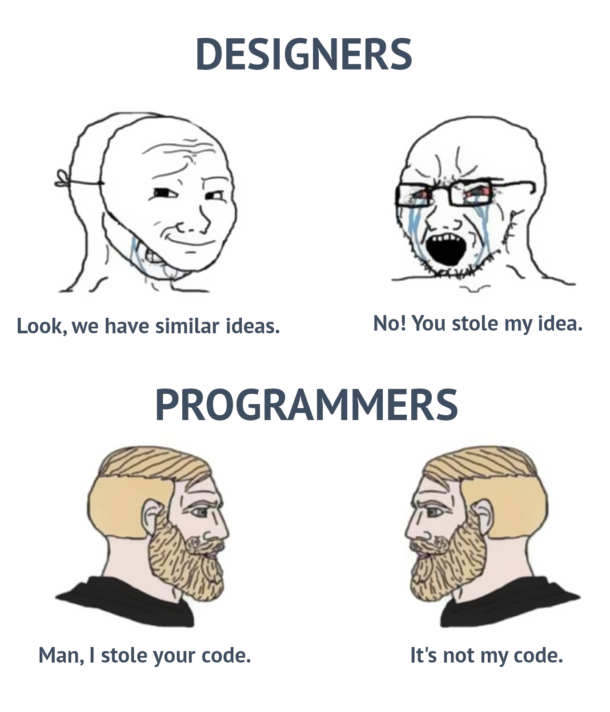

# pycobytes[404] := Where do I learn?
<!-- #SQUARK live!
| dest = 404
| title = Where do I learn?
| index = 404
| shard = special
| date = 2024 July 4
-->

Hey pips! We’re gonna end off the year with a special bonus issue :D

Programming is a journey where we never stop learning. But finding well-made, solid and extensive resources isn’t all that easy, especially with how much oversaturation there is – even more apparent now with the influx of mass-produced AI-generated articles.

Reading is a great way to learn programming since you can take everything at your own-pace and re-read anything you didn’t understand really quickly. At the same time, a video can often be much more helpful in gradually guiding you through something, especially when writing code bit-by-bit rather than just dumping the whole thing in chunks.

With that in mind, here are some really awesome YouTubers that I can personally attest for, who all make quality videos (and have nice voices, lmao) on Python, or software development as a whole!

## mcoding

Thorough, in-depth explanations of many Python mechanics – *pyco:bytes* on steroids, essentially. He covers a variety of ability levels, so you can always start with the easier videos and progressively dive deeper.

## Tech With Tim

Beginner-friendly tutorials on everything Python, with fundamentals, features, tips, tricks, and projects. If you’re looking to learn a particular topic, he’s probably got a video on it.

## Indently

Various tutorials on more specific projects, frameworks and features of Python, great for intermediates.

## Code Aesthetic

A bit nicher, and a smaller collection of videos, but very high-quality. If you’re only looking to learn how to code, these are probably not of concern right now, but if you’ve coded a lot and enjoy thinking about how to write better code, I’m sure you’ll find them quite interesting.

## Fireship

And finally, if want to explore the wider world of software development, **Fireship** is has a fantastic collection of ‘x in 100 seconds’ explainer videos on topics in programming, technology and computer science as a whole – plus regular updates on the latest tech happenings. They’re short for when you’re bored, laced with memes and irony for jokes, and come in huge playlist for you to binge to your heart’s content. One of the most awesome software development content creators out there for sure.

Thanks for reading pyco:bytes this year! We’ll be back in September ;)
